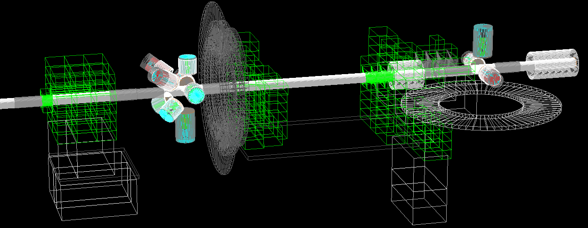

# Geant4 simulation of the UTR at HIγS



This is a [Geant4](https://geant4.web.cern.ch/) [[1]](#ref-g4_1) [[2]](#ref-g4_2) [[3]](#ref-g4_3) simulation of the Upstream Target Room (UTR) at the High Intensity γ-ray Source (HIγS) facility [[4]](#ref-higs), located at the Duke Free Electron Laser Laboratory (DFELL) of the Triangle University Nuclear Laboratory (TUNL) at Duke University, Durham, NC, USA.


## 1 Features

### 1.1 Geometry
The `DetectorConstruction.cc` has to be adapted by the user for his or her experiment. At the moment, the most relevant parts of the collimator room and the utr (γ³ setup [[5]](#ref-g3) and second setup) for different NRF experiments have been implemented in the DetectorConstruction.cc files that can be found in the `DetectorConstruction/` directory. 

To use the geometry named "DetectorConstructionXY" in the simulation, rename the files, place them in the `include/` and `src/` directory, and re-compile the simulation:

```bash
$ cd DetectorConstruction/
$ cp DetectorConstructionXY.hh ../include/DetectorConstruction.hh
$ cp DetectorConstructionXY.cc ../include/DetectorConstruction.cc
$ cd ..
$ make
```

Several pre-defined classes exist to simplify the geometry construction which are explained in the following.

#### 1.1.1 Detectors
Classes for several different detectors exist. In all of those, a G4LogicalVolume that contains all the parts of a detector is implemented which is returned by the class' Get_Logical() method. Furthermore, each detector class can return its mother volume's length and radius.

To place a detector DetectorXY in the geometry, create an instance of the detector class in DetectorConstruction.cc, get the logical volume and place it in the geometry (using Get_Length() and Get_Radius() if necessary):

```
DetectorXY* detectorXY_Instance = new DetectorXY("DetectorXY_Name");
G4LogicalVolume* DetectorXY_Logical = detectorXY_Instance->Get_Logical();
new G4PVPlacement( ... )
```

The name "DetectorXY_Name" is the name of the logical volume of the detector crystal which can be used to register it as a sensitive detector.

At the moment, the following detectors are implemented:

* Cologne LaBr, Saint Gobain BrilLanCe 380 1.5x1.5"
* Darmstadt LaBr, Saint Gobain BrilLanCe 380, 3x3"
* Duke 60% HPGe "1" (Ortec serial number 36-TN31061A)
* Duke 60% HPGe "2" (Ortec serial number 36-TN30986A)
* Duke 60% HPGe "3" (Ortec serial number 36-TN40663A)
* Duke 60% HPGe "4" (Ortec serial number 36-TN21033A)
* Duke 55% HPGe (Ortec serial number 4-TN21638A)
* Duke 55% HPGe (Ortec serial number 4-TN31524A)
* Duke 120% HPGe "Zero degree detector" (Ortec serial number 33-P40383A)
* Darmstadt HPGe "1" (Canberra serial number 10PC473156-A)
* Darmstadt HPGe "2" (Eurisys Mesures serial number 10PC447589-A)
* Darmstadt Clover "Polarimeter" (Eurisys Mesures serial number 10PC447590-a)

#### 1.1.2 Bricks
For maximum flexibility, the shielding of the setup can be constructed brick by brick. To avoid the `G4Solid->G4LogicalVolume->G4PhysicalVolume` procedure each time one would like to place a standardized brick, a lot of them are predefined as classes in `Bricks.hh`.

Once instantiated in DetectorConstruction.cc, bricks can be placed inside the G4LogicalVolume which was defined to be their mother volume via their constructor. To place a brick, use the `Put(x, y, z, angle_x, angle_y, angle_z)` method in which the coordinates and rotation angles around the coordinate axes can be specified.

Bricks are assumed to be cuboid objects, i.e. they can have 3 different side lengths. In `Bricks.hh`, the convention is that the long side points in z-direction, the medium side in x-direction and the short side in y-direction, if they can be distinguished. The respective lengths can be accessed via the member variables L, M and S.

#### 1.1.3 Filters
Similar to bricks, filters and filter cases in front of detectors are implemented in `Filters.hh` and can be placed using their `Put()` methods.

#### 1.1.4 Targets
Complicated targets can be implemented in `Targets.hh`. The placement in DetectorConstruction.cc works analog to the placement of detectors. Relevant properties of the targets can be made accessible using Get() methods.

### 1.2 Sensitive Detectors

Information about the simulated particles is recorded by instances of the G4VSensitiveDetector class. Any unique logical volume can be declared a sensitive detector. 
Any time a particle executes a step inside a G4VSensitiveDetector object, its ProcessHits routine will access information of the step. This way, live information about a particle can be accessed. Note that a "hit" in the GEANT4 sense does not necessarily imply an interaction with the sensitive detector. Any volume crossing is also a hit. Therefore, also non-interacting geantinos can generate hits, making them a nice tool to explore to explore the geometry, measure solid-angle coverage, ...
After a complete event, a collection of all hits inside a given volume will be accessible via its HitsCollection. This way, cumulative information like the energy deposition inside the volume can be accessed.

Three types of sensitive detectors are implemented at the moment:

* **EnergyDepositionSD**
    Records the total energy deposition by any particle per single event inside the sensitive detector.
* **ParticleSD**
    Records the first step of any particle inside the sensitive detector.
* **SecondarySD**
    Records the first step of any secondary particle inside the sensitive detector.
    
No matter which type of sensitive detector is chosen, the simulation output will be a [ROOT](https://root.cern.ch/) tree with a user-defined subset (see section **1.6 Output File Format**) of the following 10 branches:

* **ekin**
    Kinetic energy (in MeV) of the particle at the time of its first hit of the sensitive detector.
* **edep**
    Total energy deposition (in MeV) of the event (EnergyDepositionSD) OR energy deposition of the first hit of the sensitive detector (ParticleSD, SecondarySD)
* **particle**
    Type of the particle whose first hit of the sensitive detector it was (ParticleSD, SecondarySD) OR type of the very first particle in this event that hit the sensitive detector (EnergyDepositionSD). The type of the particle is encoded in the [Monte Carlo Particle Numbering Scheme](http://pdg.lbl.gov/mc_particle_id_contents.html).
* **volume**
    User-defined identifier of the sensitive detector that recorded this set of data.
* **x/y/z**
    Coordinates (in mm) of the first hit of the sensitive detector by a particle (ParticleSD, SecondarySD) OR coordinates of the first hit by the first particle in this event that hit the sensitive detector (EnergyDepositionSD)
* **vx/vy/vz**
    Momentum (in MeV/c) of the particle at the position of the first hit of the sensitive detector (ParticleSD, SecondarySD) OR momentum of the first particle hitting the sensitive detector in this event at the position of its first hit (EnergyDepositionSD).
    
The meaning of the columns sometimes changes with the choice of the sensitive detector.

To make a volume whose logical volume name is "Logic_Name" a sensitive detector of type XYSD, add the following lines in DetectorConstruction::ConstructSDandField(){}

```
XYSD *xySD = new XYSD("SD_Name", "SD_HitsCollection_Name");
G4SDManager::GetSDMpointer()->AddNewDetector(xySD);
xySD->SetDetectorID(volume); // volume is the detector ID which will be displayed in the ROOT output file
SetSensitiveDetector("Logic_Name", xySD, true);
```

The following examples illustrates how the different sensitive detectors work.


In the figure, a photon (orange, sinusoidal line) and several electrons (blue arrow) are shown which are part of a single event. Each hit in the sensitive detector (black circle) has a label that contains the particle number and the number of the hit. The history of the event is as follows:

The primary particle 1 (a photon with an energy of 2.5 MeV) enters the sensitive detector at (0,3). It is Compton-scattered at (2,5) and transfers 1.0 MeV to an electron (particle 2). The electron slowly loses its kinetic energy again in scattering processes at (4,8), (6,9) and (7,8) inside the sensitive detector which do not create new secondary particles. In the meantime, particle 1 travels to (6,1) and creates an e-/e+ pair with its remaining 1.5 MeV. Each lepton (3 and 4) gets an initial energy of (1.500 - 1.022)/2 = 0.239 MeV. Lepton 3 loses its kinetic energy inside the sensitive detector, Lepton 4 leaves the sensitive detector.

The following information would be recorded if the volume was a ...

* ... ParticleSD

```
ekin	edep	particle	volume	x	y	vx	vy
2.5		0.		22			0		0	3	2	2
1.0		0.		11			0		2	5	2	5
0.239	0.		11			0		6	1	3	3
0.239	0.		11			0		6	1	-2	-2
```
* ... SecondarySD

```
ekin	edep	particle	volume	x	y	vx	vy
1.0		0.		11			0		2	5	2	5
0.239	0.		11			0		6	1	3	3
0.239	0.		11			0		6	1	-2	-2
```
* ... EnergyDepositionSD

```
ekin	edep		particle	volume	x	y	vx	vy
2.5		1.989		22			0		0	3	2	2
```

For simplicity, the momentum vector is given as the vector of the depicted arrow.
The real values would be

```
vx_real = 1/sqrt(vx^2 + vy^2)*cos(arctan(y/x))*ekin/c
vy_real = 1/sqrt(vx^2 + vy^2)*sin(arctan(y/x))*ekin/c
```

### 1.3 Event generation

Event generation is done by classes derived from the `G4VUserPrimaryGeneratorAction`. In the following, the existing event generators are described. To use a certain event generator in the simulation, initialize it by adding

```
 SetUserAction(new EVENTGENERATORXY)
```

 to `ActionInitialization::Build()` in `ActionInitialization.cc`. Comment out all other event generators. After that, re-compile the code.
 
#### 1.3.1 GeneralParticleSource

This event generator uses the G4GeneralParticleSource whose parameters can be controlled by a macro file. For further information, see the GEANT4 documentation.

#### 1.3.2 AngularDistributionGenerator

The AngularDistributionGenerator generates monoenergetic particles that originate in a given G4PhysicalVolume of the DetectorConstruction and have a certain angular distribution.

The physical volume (the "source") and angular distribution can have arbitrary shapes. Starting positions and momentum directions are created using a Monte-Carlo method:
Given a(n)

* Cuboid in 3 dimensions that completely contains the source volume
* Angular distribution W(θ, φ)

AngularDistributionGenerator generates uniform random
 
* Positions `(random_x, random_y, random_z)` 
* Tuples `(random_θ, random_φ, random_W)`

until 

* The position `(random_x, random_y, random_z)` is inside the source physical volume
* `random_W <= W(random_θ, random_φ)`

If both conditions are fulfilled, a particle is emitted from `(random_x, random_y, random_z)` in the direction `(θ, φ)`.

The process of finding a starting point is depicted in the figure below. The yellow star-shaped source volume is inside a dashed box which is the container volume. Random points inside the container volume are either black or red, depending on whether they are inside or outside the source volume. Only from the black points, particles are emitted (in random directions).


Clearly, the algorithm works well if

* the cuboid approximates the shape of the source well
* the angular distribution varies smoothly in the `(θ, φ)` plane

The maximum number of randomly sampled points can be set in `AngularDistributionGenerator.cc`where it says:

```
MAX_TRIES_POSITION = ...
MAX_TRIES_MOMENTUM = ...
```

AngularDistributionGenerator can do a self-check before the actual simulation in which it creates `MAX_TRIES_XY` points and evaluates how many of the were valid. From this, the probability *p* of not hitting the source volume / angular distribution can be estimated. If `p * N >~ 1`, where N is the number of particles to be simulated, the algorithm will very probably fail once in a while, so try increasing `MAX_TRIES_XY`. A typical output of the self-check looks like:

```
G4WT0 > ========================================================================
G4WT0 > Checking Monte-Carlo position generator with 100 3D points ...
G4WT0 > Check finished. Of 100 random 3D points, 82 were inside volume 'Se82_Target' ( 82 % )
G4WT0 > Probability of failure:	pow( 0.18, 100 ) = 3.36706e-73 %
G4WT0 > ========================================================================
```

To change parameters of the AngularDistributionGenerator, edit the constructor in `AngularDistributionGenerator.cc` and the angular distribution parameters at the beginning of the `GeneratePrimaries()` method. The adjustable parameters are:

* `MAX_TRIES_XY`
* Particle type
* Particle energy
* Position and dimensions of the container box
* Name of the source physical volume
* Identifiers of the angular distribution

The identifiers of the angular distribution are given to the simulation as an array of numbers called `states` whose length has to be specified by the user.
For "real" NRF angular distributions, this array of numbers will be the spins of the excited states in a cascade, with the parity indicated by the sign of the numbers. In another array, the multipole mixing ratios between the transitions can be entered.

At the moment, the following distributions are implemented:

* `states == {0.1, 0.1, 0.1}`
    Wildcard for test distributions
* `states == {0., 0., 0.}`
    Isotropic distribution
* `states == {0., 1., 0.}`
    0+ -> 1+ -> 0+
* `states == {0., -1., 0.}`
    0+ -> 1- -> 0+
* `states == {0., 2., 0.}`
    0+ -> 2+ -> 0+
* `states == {0., 1., 2.}`
    0+ -> 1+ -> 2+
* `states == {0., -1., 2.}`
    0+ -> 1- -> 2+
        
### 1.4 Physics
The physics processes are defined in `/src/Physics.cc`. In the Physics::ConstructProcess() method, physics lists for groups of particles can be activated by uncommenting the desired physics list. If you are working on a slow machine and you just want to visualize the geometry, it can be advantageous to switch off all physics.

At the moment, physics processes for gammas, electrons/positrons, neutrons and other charged particles are available. Check Physics.cc to see which processes are defined.
A description of the processes can be found in the [GEANT4 Physics Reference Manual](http://geant4.web.cern.ch/geant4/UserDocumentation/UsersGuides/PhysicsReferenceManual/fo/PhysicsReferenceManual.pdf)

The physics list is optimized for NRF applications and largely inspired by the GEANT4 examples `TestEm7` and `Hadr04`.

#### 1.4.1 Transportation
Mandatory for all particles. Without this, the simulation will do nothing.

#### 1.4.2 EMPenelope, EMLivermore
Uses the Penelope OR Livermore low-energy electromagnetic physics framework for gammas, electrons and positrons. Only one of them can be active at the same time. 

Both frameworks aim at a more precise description of these processes than the standard G4 physics which are optimized for particle physics applications at CERN.

#### 1.4.3 HPNeutron
A specialized neutron physics framework for low energies.

#### 1.4.4 ChargedParticle
Standard processes for any other charged particle that might appear in the simulation. The probability for this in NRF applications is low, so this list is not very detailed.

### 1.5 Random Number Engine
In `utr.cc`, the random number engine's seed is set by using the current CPU time, making it a "real" random generator.

```
G4Random::setTheEngine(new CLHEP::RanecuEngine);
// 'Real' random results
time_t timer;
G4Random::setTheSeed(time(&timer));
```

If you want deterministic results for some reason, comment these lines out and uncomment 

```
G4Random::setTheSeed(long n);
```

Re-compile afterwards. 
After this change, every restart of the simulation with unchanged code will yield the same results.

### 1.6 Output File Format
In section **1.2 Sensitive Detectors** the format of the ROOT output file was already introduced. The possible branches are 

* **ekin**
* **edep**
* **particle**
* **volume**
* **x/y/z**
* **vx/vy/vz**

The user can specify in `ActionInitialization.cc` which of these quantities should be written to the ROOT file, to avoid creating unnecessarily large files. When the `RunAction` is initialized in `ActionInitialization.cc`, set the value of the corresponding output flag to 0 if this quantitiy should not be written to the ROOT file.

For example, the code

```
output_flags[EKIN] = 0;
output_flags[EDEP] = 1;
output_flags[PARTICLE] = 1;
output_flags[VOLUME] = 1;
output_flags[POSX] = 0;
output_flags[POSY] = 0;
output_flags[POSZ] = 0;
output_flags[MOMX] = 0;
output_flags[MOMY] = 0;
output_flags[MOMZ] = 0;
```

would only write the energy deposition, the particle type and the senstive detector volume.

## 2 Getting started

These instructions will get you a copy of the simulation running.

### 2.1 Dependencies

To build and run the simulation, the following dependencies are required:

* [Geant4](https://geant4.web.cern.ch/) (tested with version 10.03)
* CMake (*build*)
* Make (*build*)

Furthermore, to use the analysis scripts:

* [ROOT](https://root.cern.ch/) (tested with version 5.34/36)

### 2.2 Compilation

To compile the simulation, simply execute

```bash
$ cmake .
$ make
```

This will create the `utr` binary in the top directory.
In case CMake complains that it cannot find `Geant4Config.cmake` or `geant4-config.cmake`, set the *CMAKE_INSTALL_PREFIX* variable to the directory where GEANT4 has been installed:

```bash
$ cmake -DCMAKE_INSTALL_PREFIX=/PATH/TO/G4/INSTALL .
$ make
```

## 3 Usage

The compiled `utr` binary can be run with different arguments. To get an overview, type

```bash
$ ./utr --help
```

Running `utr` without any argument will launch a UI session of the simulation where macro commands can be entered. To visualize the geometry in the UI session, execute the macro file `init_vis.mac`
```
/control/execute init_vis.mac
```

Important optional arguments besides `--help` are:
```bash
$ ./utr -m MACROFILE
```
Executes macro file MACROFILE
```bash
$ ./utr -t NTHREADS
```
Sets the number of threads in multithreaded mode (default: 1)

## 4 Output Processing

The directory `OutputProcessing` contains some **sample** ROOT scripts that can be used to process the simulation output.
Executing
```bash
$ chmod +x compile_ROOT_scripts.sh
$ ./compile_ROOT_scripts.sh
```
in this directory should compile all the scripts and either create executables in the `utr` directory or simply copy the scripts depending on whether they are standalone programs or really just scripts.
The compilation may fail if the `ROOTSYS` environment variable is not set on your system.
Executables can be run like
```bash
$ ./EXECUTABLENAME {ARGUMENTS}
```
Scripts have to be loaded into ROOT first:
```bash
$ root
root [0] .L SCRIPTNAME.cpp
root [1] SCRIPTNAME( {ARGUMENTS} )
```
### 4.1 RootToTxt.cpp (script)
`RootToTxt` converts a ROOT output file (*TFile*) containing an n-tuple of data (a *TTree* with *TBranch* objects) to a simple text file with the same content. If you want to convert a ROOT file ROOTFILE, type
```bash
$ root
root [0] .L RootToTxt.cpp
root [1] RootToTxt( "ROOTFILE" )
```
The ROOT file can have a TTree with an arbitrary name and an arbitrary number of TBranch objects. The output text file has the same name as the ROOT file but with a ".txt" suffix.
Be aware that conversion into text files increases the file size.

### 4.2 getHistogram (executable)
`getHistogram` sorts the data in an output file into a ROOT histogram and saves the histogram in a new file.
The script can be used to merge multiple files and extract a histogram from all of them, since large-scale simulations will most probably be run on several threads. The script is used as follows:
```bash
$ ./getHistogram TREE PATTERN1 PATTERN2 OUTPUTFILE
```
With the arguments

* TREE: Name of the ROOT tree ("utr" in this case)
* PATTERN1 and 2: Two strings that uniquely identify the set of files you would like to merge
* OUTPUTFILE: name of the output file that contains the histogram 

**A short example:**
The typical output of two different simulations on 2 threads each are the files
```
master.root
utr0_t0.root
utr0_t1.root
utr1_t0.root
utr1_t1.root
```
(The `master.root` file has to be there but it contains no data) 
Assuming you would like to merge both threads of `utr0` and get a common histogram, you execute
```bash
$ ./getHistogram utr utr0 .root utr0.root
```
This will create an output file called `utr0.root` with the desired histogram.
If, instead, you wanted to merge *all* ROOT files, do
```bash
$ ./getHistogram utr utr .root utr0.root
```
In this simple example, already the first pattern uniquely identifies the files you want to merge. However, imagine there was a file `utr0.txt` in the same directory, then the second pattern could be used to exclude this.
The user has to hard-code the desired histograms in `OutputProcessing/GetHistogram.cpp`, i.e. edit the lines
```
	// Create histogram
	TH1* h1 = new TH1F("h1", "Energy Deposition in ZeroDegree", 10000, 0., 10.);

	// Fill histogram from TBranch in TChain with user-defined conditions
	Double_t Edep, Volume, Particle;

	utr.SetBranchAddress("edep", &Edep);
	utr.SetBranchAddress("particle", &Particle);
	utr.SetBranchAddress("volume", &Volume);

	for(int i = 0; i < utr.GetEntries(); i++){
		utr.GetEntry(i);

		if(Edep > 0. && Volume == 5 && Particle == 22){
			h1->Fill(Edep);
		}
	}

	// Write histogram to a new TFile
	TFile *of = new TFile(outputfilename, "RECREATE");

	h1->Write();
```
The sample code above creates a histogram (0 to 10 MeV, 10^4 bins) of all energy depositions by photons (Particle ==22) in volume 5.
The shell script `loopGetHistogram.sh` shows how to loop the script over a large number of files.

## 5 License

*TODO*


## 6 References

<a name="ref-g4_1">[1]</a> S. Agostinelli *et al.*, “GEANT4 - a simulation toolkit”, Nucl. Inst. Meth. A **506.3**, 250 (2003). [`doi:10.1016/S0168-9002(03)01368-8`](http://dx.doi.org/10.1016/S0168-9002(03)01368-8).  
<a name="ref-g4_2">[2]</a> J. Allison *et al.*, “GEANT4 developments and applications”, IEEE Transactions on Nuclear Science, **53.1**, 270 (2006). [`doi:10.1109/TNS.2006.869826`](https://doi.org/10.1109/TNS.2006.869826).  
<a name="ref-g4_3">[3]</a> J. Allison *et al.*, “Recent developments in GEANT4”, Nucl. Inst. Meth. A **835**, 186 (2016). [`doi:10.1016/j.nima.2016.06.125`](http://dx.doi.org/10.1016/j.nima.2016.06.125).  
<a name="ref-higs">[4]</a> H. R. Weller *et al.*, “Research opportunities at the upgraded HIγS facility”, Prog. Part. Nucl. Phys. **62.1**, 257 (2009). [`doi:10.1016/j.ppnp.2008.07.001`](https://dx.doi.org/10.1016/j.ppnp.2008.07.001).  
<a name="ref-g3">[5]</a> B. Löher *et al.*, “The high-efficiency γ-ray spectroscopy setup γ³ at HIγS”, Nucl. Instr. Meth. Phys. Res. A **723**, 136 (2013). [`doi:10.1016/j.nima.2013.04.087`](https://dx.doi.org/10.1016/j.nima.2013.04.087).  

