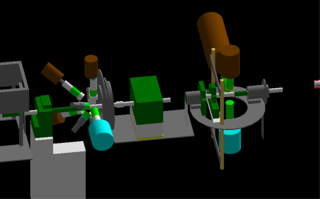
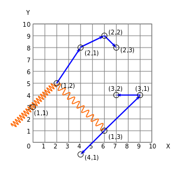
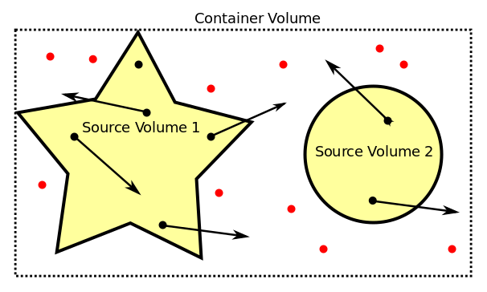
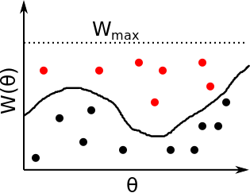
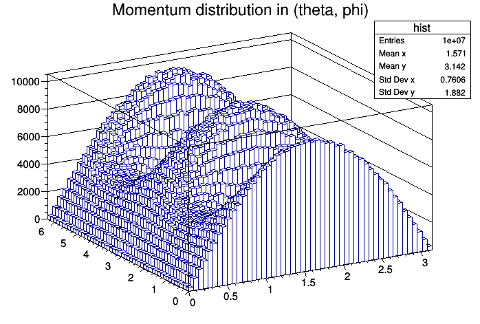
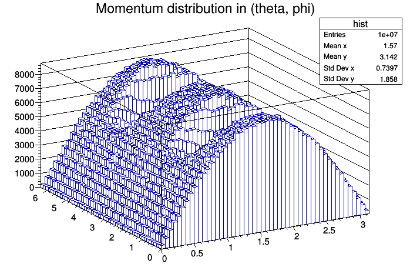
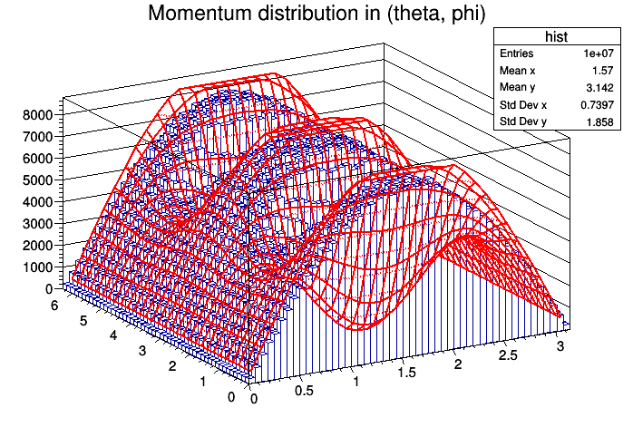
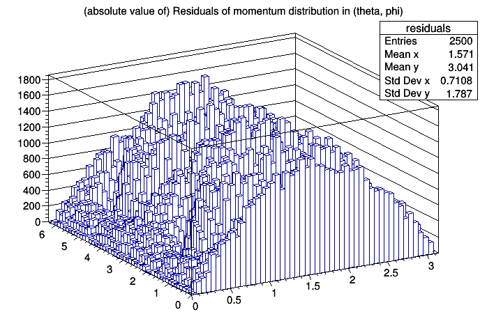

# Geant4 simulation of the UTR at HIγS



This is a [Geant4](https://geant4.web.cern.ch/) [[1]](#ref-g4_1) [[2]](#ref-g4_2) [[3]](#ref-g4_3) simulation of the Upstream Target Room (UTR) at the High Intensity γ-ray Source (HIγS) facility [[4]](#ref-higs), located at the Duke Free Electron Laser Laboratory (DFELL) of the Triangle University Nuclear Laboratory (TUNL) at Duke University, Durham, NC, USA.

# Table of Contents

 1. [Quick Start](#quickstart)
 2. [Features](#features)
 
    2.1 [Geometry](#geometry)
    
    2.2 [Sensitive Detectors](#sensitivedetectors)
    
    2.3 [Event Generation](#eventgeneration)
    
    2.4 [Physics](#physics)
    
    2.5 [Random Number Engine](#random)
    
    2.6 [Output File Format](#outputfileformat)
    
 3. [Installation](#installation)
 
    3.1 [Dependencies](#dependencies)
    
    3.2 [Compilation](#compilation)
    
 4. [Usage and Visualization](#usage)
 5. [Output Processing](#outputprocessing)
 6. [Unit Tests](#unittests)
 
    6.1 [AngularDistributionGenerator](#angulardistributiongenerator)
    
 7. [License](#license)
 8. [Acknowledgements](#acknowledgements)
 9. [References](#references)

## 1 Quick Start <a name="quickstart"></a>

This section is an overview or checklist for a user who wants to implement his own geometry and do simulations.

### 1.1 Follow the installation instructions

See section [3 Installation](#installation)

### 1.2 Read about the usage

See section [4 Usage and Visualization](#usage)

### 1.3 Create a DetectorConstruction

 1. Create a new campaign in `DetectorConstruction/` and/or a new directory in `DetectorConstruction/Campaign_YEAR`.
 2. Implement a geometry in a `DetectorConstruction.hh` and `DetectorConstruction.cc` file in this directory and maybe some auxiliary files following the conventions (see section [2.1 Geometry](#geometry)).
 3. Configure `utr` to use the new geometry using the cmake build option (see sections [2.1 Geometry](#geometry) or [3.3 Build configuration](#build))

### 1.4 Define sensitive volumes

 1. In `DetectorConstruction.cc`, set volumes as sensitive detectors. There is the choice between 3 different detector types that record different information about particles (see section [2.2 Sensitive Detectors](#sensitivedetectors)).
 2. Using cmake build options, set the quantities that should be written to the output file (see section [2.2 Sensitive Detectors](#sensitivedetectors) and [3.3 Build configuration](#build)).

### 1.5 Choose a primary source

Configure `utr` to use either the `G4GeneralParticleSource`, the `AngularDistributionGenerator` or the `AngularCorrelationGenerator` using the CMake build option (see sections [2.3 Event Generation](#eventgeneration) and [3.3 Build configuration](#build))

### 1.6 Choose the physics processes

Using cmake build variables, activate or deactivate physics modules, or implement a custom physics list and include it in `src/Physics.cpp` (see section [2.4 Physics](#physics) and [3.3 Build configuration](#build))

### 1.7 Choose random number seed

In `utr.cc`, set the random number seed explicitly to get deterministic results. It is not clear whether this works in multithreaded mode. See section [2.5 Random Number Engine](#random)

### 1.8 Set up a macro file

Create a macro file that contains instructions for the primary generator (see section [2.3 Event Generation](#eventgeneration)). 

Do not simulate more than 2^32 ~ 2 billion particles using `/run/beamOn`, since this causes an overflow in the random number seed, giving you in principle the same results over and over again. Execute the same simulation multiple times instead.

### 1.9 Run the simulation

Consider creating a macro like `loop.mac` to loop over variables in your macro file.
(See section [4 Usage and Visualization](#usage))

### 1.10 Analyze the output

See section [5 Output Processing](#output)

## 2 Features <a name="features"></a>

### 2.1 Geometry <a name="geometry"></a>
In Geant4, all geometry is implemented in a class which is derived from `G4VUserDetectorConstruction`. In `utr`, the user-implemented geometry can be found in files called `DetectorConstruction.hh` or `DetectorConstruction.cc`. Since the setup at HIGS is subject to many changes in between, and also during experiments, many different geometry implementations exist.

Since the 2018 campaign, we encourage to stick to the following directory structure and naming convention for the geometry files:

```
utr/
    utr.cc      # main()
    include/    # user actions and auxiliary permanent geometry
    src/        # user actions and auxiliary permanent geometry
    DetectorConstruction/
        Campaign_YEAR/
            include/    # auxiliary campaign- and run-specific geometry
                Setup_RUNS.hh
            src/        # auxiliary campaign- and run-specific geometry
                Setup_RUNS.cc
            TARGETS_RUNS/
                DetectorConstruction.hh
                DetectorConstruction.cc
```

As in reality, a geometry file only holds for a certain number of runs, which are part of a campaign. Therefore, unique `DetectorConstruction.cc` files can be found at the run-level. In principle, one could put all the geometry into this file, and before the 2018 campaign, it was done like that because the file was growing and growing. In the meantime, UG has tried to learn from his mistakes: The `DetectorConstruction.cc` files should be as short as possible, delegating all the low-level construction jobs to auxiliary classes (please see [2.1.1 Note on auxiliary files](#auxiliary_files)). The auxiliary classes can be placed into different directories, depending on their nature:
Geometry which is expected to be permanent (for example detectors, or furniture), even between different campaigns, should be placed in the `utr/include` and `utr/src` directories.
More volatile geometry should be placed in the corresponding campaign, i.e. `utr/DetectorConstruction/Campaign_YEAR/include` and `utr/DetectorConstruction/Campaign_YEAR/src`.
*Sometimes, the difference may not be so clear, and at the moment the sorting is probably not consistent, but our team is still tidying up the 2018 campaign. Everything before 2018 does not follow these conventions, but has been sorted according to the directory structure above anyway to ensure backward compatibility.*

At the moment, detailed implementations of the geometry of the 2016/2017 campaign and parts of the 2018 campaign exist. They include geometry close to the beamline in the collimator room and the UTR including, of course, the experimental setups (γ³ setup [[5]](#ref-g3), second setup and recently also an ionization chamber for photofission experiments). Less detailed geometries exist for selected experiments in older campaigns. The geometries for the 2013 and 2014/2015 campaign are based on the geometry from 2016/2017, the geometry for the 2012 campaign is based on the geometry from 2018.

An implementation of the Darmstadt High-Intensity Photon Setup (DHIPS) [[6]](#ref-dhips) is under construction at the moment. Its geometry will be organized similar to the HIγS geometry from 2018.

By default, `utr` will use the geometry in `DetectorConstruction/Campaign_2018/64Ni_271_279`. Existing geometries can be switched very quickly using cmake build variables. For example, to use the geometry in `utr/DetectorConstruction/Campaign_YEAR/TARGETS_RUNS`, set the corresponding CMake variables and re-build the code (see also [3 Installation](#installation)):

```bash
$ cmake -DCAMPAIGN="Campaign_YEAR" -DDETECTOR_CONSTRUCTION="TARGETS_RUNS" .
```

Several pre-defined classes exist to simplify the geometry construction which are explained in the following.

#### 2.1.1 Note on auxiliary files <a name="auxiliary_files"></a>

In order to prevent the geometry files from growing too large, it is very helpful to divide the setup into logical parts and implement them im separate auxiliary classes. This also makes it easy to switch parts of the geometry on and off without having to comment hundreds of lines.

A common practice is to create `LogicalVolume` objects (pointers) in the auxiliary files that contain several parts, import their mother volume into `DetectorConstruction.cc`, and place it:

```
// Auxiliary.hh
    ...
    class Auxiliary{
        ...
        Auxiliary();
        G4LogicalVolume* Auxiliary_Logical;
        G4LogicalVolume* Get_Logical(){ return Auxiliary_Logical };
        ...
    };
    ...
// Auxiliary.cc
    ...
    Auxiliary::Auxiliary(){
        ...
        Auxiliary_Logical = new G4LogicalVolume(...);
        ...
    }
    ...
// DetectorConstruction.cc
    ...
    Auxiliary_Logical aux;
    G4LogicalVolume* aux_log = aux.Get_Logical();
    new G4PVPlacement(rot, pos, aux_log, "aux", ... );
    ...
```

However, this caused some problems in the case of `utr`.
For example, the floor and the walls are clearly a logical unit that can be implemented in a separate file. Since the floor and the walls are as long and wide as the whole setup, the mother volume of this auxiliary class would unnecessarily overlap with everything.

Here, instead, we chose to pass the global mother volume to the auxiliary classes and let them make the placements in a `Construct(G4ThreeVector global_coordinates)` method.

```
// Auxiliary.hh
    ...
    class Auxiliary{
        ...
        Auxiliary(G4LogicalVolume* World_Log){World_Logical = World_Log};
        Construct(G4ThreeVector global_coordinates);
        G4LogicalVolume* World_Logical;
        ...
    }
    ...
// Auxiliary.cc
    ...
    Auxiliary::Construct(G4ThreeVector global_coordinates){
        ...
        new G4PVPlacement(rot, global_coordinates + pos, Aux_Logical, "aux", World_Logical, ...);
        ...
    }
    ...
// DetectorConstruction.cc
    ...
    Auxiliary_Logical aux(World_Logical);
    aux.Construct(global_coordinates);
    ...
```

By passing the global coordinates to the auxiliary file, the placements there can still be done in a local coordinate system.  These examples are only to illustrate the differences, have a look at the geometry from the 2018 campaign for more details.

This positioning scheme prevents overlaps of mother volumes. **However, the order of placements is still important!** The last element placed will be at the top of the hierarchy. For example, if there is a target mounted inside the beam pipe (i.e. the volume of the pipe completely covers the target), the following would be the correct order of placements:

```
// DetectorConstruction.cc
    beamPipe.Construct(global_coordinates_beamPipe);
    target.Construct(global_coordinates_target);
```

The alternative order

```
// DetectorConstruction.cc
    target.Construct(global_coordinates_target);
    beamPipe.Construct(global_coordinates_beamPipe);
```

would place the beam pipe on top of the target, and therefore ignore the target when tracking particles. Note that this problem would also occur if we used the other placement scheme.

A disadvantage of this placement scheme is that the volume hierarchy is very flat, because everything is placed inside the global mother volume. This makes it harder, to find a specific volume in the UI mode and easier to have name clashes. Nevertheless, we think that the advantages are more important.

#### 2.1.2 Detectors <a name="detectors"></a>

Since the 2018/2019 campaigns (for older geometries, see the next section, [2.1.3 Detectors before 2018 campaign](#detectors_before_2018)), the detector placement is done by an auxiliary class, in complete analogy to the procedure described in [2.1.1 Note on auxiliary files](#auxiliary_files)). All parts of the detectors are placed inside the global world volume to minimize the risk of overlaps.

To simplify the placement of a detector, their `Construct()` method takes four additional mandatory arguments, which are the angles θ and φ in spherical coordinates, a radial distance `rt` to the point indicated by `global_coordinates`, and an intrinsic rotation angle `intrinsic_rotation` with respect to the main axis. For many of the detectors, the main axis is equal to the cylindrical symmetry axis. However, there are some detectors which break the continuous rotational symmetry around the main axis, for example the clover detectors. This is why the README refers to the 'main axis', whose meaning should be intuitive even for non-cylindrically symmetric detectors. If placed with the `Construct()` method, the main axis of the detector crystal will be parallel to the unit vector in spherical coordinates defined by θ and φ, and it will face a target at the point `global_coordinates`. To be precise, `rt` defines the distance from `global_coordinates` to the center of the detector face. Furthermore, the detector will be rotated by an angle of the magnitude `intrinsic_angle` around its main axis.

Assuming that a detector of the class `Detector` should be placed in the world logical volume `World_Logical` at angles `theta` and `phi`, with the distance `distance_from_center` to the point `global_coordinates`, the most general procedure for the placement is:

```
// This line is always necessary
Detector detector_instance(World_Logical, detector_name);
// The following two lines are only necessary if such a collection of detector properties exists
Detector_Collection collection_instance;
detector_instance.setProperties(instance.DetectorXY)
// Code similar to the following 3 lines can be used to add shielding to the detector which
// will be placed automatically. By convention, shielding which is added first will be placed closest to 
// the detector. The set of parameters of the methods may depend on the detector type.
detector_instance.Add_Wrap("G4_Pb", 1.*mm)
detector_instance.AddFilter("G4_Cu", 1.*mm, 45.*mm)
detector_instance.AddFilter("G4_Pb", 2.*mm, 45.*mm)
// This line is always necessary
detector_instance.Construct(global_coordinates, theta, phi, distance_from_center, intrinsic_rotation);
```
In the following, the mandatory lines in the code example will be described first. After that comes a description of the placement of filters, and in the end the concept of detector collections will be explained.

In order to place a detector, an object of the corresponding detector class must be created, which takes its world volume as a first argument in the constructor. The second argument of the constructor in the code example is the name of the detector object, which should be unique in the whole detector geometry. It will be appended as a prefix to all solid/logical/physical volumes of the object to be able to identify them unambiguously. Furthermore, it will be the name of the logical volume of the detector crystal, which must be passed to the `SetSensitiveDetector()` method in order to make it a sensitive detector (see also [2.2 Sensitive Detectors](#sensitivedetectors)). In the case of a clover detector, which consists of several disconnected crystals, a suffix will be added to `detector_name` to be able to identify the single crystals (see below). By deriving most of the existing detectors from the abstract base class `Detector`, it is ensured that all detectors provide the same `Construct()` function and methods to add filters and wraps (see below). An alternative version of the `Construct()` function exists which does not need the intrinsic rotation angle.

In addition, most of the implemented detectors have a method to automatize the placement of shielding on the face of the detector (*filters*) and around the front part of the detector (*wraps*). They are called `Add_Filter()` and `Add_Wrap()` and must be called before the `Construct()` method is invoked, because they append new entries to an internal list of filters and wraps which will be iterated through during construction. The position of the detector as defined by the variables θ, φ and `rt` will not be changed by the addition of filters and wraps. If multiple calls of `Add_XY()` are made, the corresponding filters (wraps) will be stacked on top (wrapped around) the previously constructed objects automatically. The first filter or wrap place by the `Add_XY()` method will be in direct contact with the detector surface if no filter cases are used. Filter cases are white plastic cases which were designed by B. Löher and J. Isaak and manufactured by the TUNL workshop at some point during the 2015/2016 campaign to simplify the placement of filters. They consist of a plastic case with an inner thread that contains a set of filters. A ring can be screwed into the thread to keep the filters in place. Some `Construct()` methods provide flags to enable the construction of such a filter case with or without the aforementioned ring (At some point, it was found that the screwing and unscrewing of the rings is tedious, so they are not used frequently anymore. Since using the ring or avoiding it changes the distance of the filters slightly, this options also exists in the simulation code).

The `utr` code includes implementations of several different detectors. Most of the detectors are implemented by reading off the dimensions from some data sheet. Usually, these data sheets, for example the ones from the [ORTEC](https://www.ortec-online.com/) company, only include the front part of the detector around the crystal. However, all detectors have an additional case for the electronics/photomultipliers/preamplifiers, and most HPGe detectors, in particular, have a dewar vessel for liquid nitrogen cooling. To get a better feeling for the dimensions of the setup and for aesthetic reasons, the dimensions of these parts have been measured or estimated by the the authors. Usually, the dimensions that can be measured without taking a detector apart are known well (for example the length of the dewar vessel), while the inner structure is poorly known (for example the wall thickness of the cases, or the composition of the electronics). Therefore, they have mostly been constructed as empty shells (mostly made of aluminium). The hope is that they represent a zero-order approximation to the actual composition of the detector parts. If desired, only the parts that are actually taken from data sheets can be constructed by setting the corresponding flags. For example, only by calling the `HPGe_Coaxial::useDewar()` method before invoking `HPGe_Coaxial::Construct()` the dewar vessels of the coaxial HPGe detectors will be constructed.

Depending on the topology of the detector, general classes exist in some cases to avoid copying and pasting. For example, all coaxial HPGe detectors contain essentially the same components, but with different dimensions. Therefore, a general `HPGe_Coaxial` class, structures to associate meaningful names with the dimensions `HPGe_Coaxial_Properties` and a dictionary of dimensions, called `HPGe_Collection`, have been implemented to avoid very repetitive class definitions for each detector. In between the creation of an object of a general class and the actual construction, the particular properties have to be intialized using the `setProperties()` method. Without this, the detector construction will fail or produce nonsense values. Below is a list of real detectors that can be built with the existing code, ordered by the style of implementation. If not mentioned otherwise, the detectors are derived from the `Detector` class.

**Coaxial HPGe detectors**: An abstract class `HPGe_Coaxial` exists, which implements the main parts of a coaxial detector (crystal, mount cup, end cap, cold finger, dewar). The particular dimensions of the parts for each detector are stored in a data structure called `HPGe_Coaxial_Properties`. The dimensions of each of the following detectors and a short description can be found in an additional header file, `src/HPGe_Collection.hh`:

 * Duke 55% HPGe (Ortec serial number 4-TN21638A)
 * Duke 55% HPGe (Ortec serial number 4-TN31524A)
 * Duke 60% HPGe (Ortec serial number 36-TN21033A)
 * Duke 60% HPGe (Ortec serial number 36-TN30986A)
 * Duke 60% HPGe (Ortec serial number 36-TN31061A)
 * Duke 60% HPGe (Ortec serial number 36-TN40663A)
 * Duke 120% HPGe "Zero degree detector" (Ortec serial number 33-P40383A)
 * TUD 80% HPGe (Canberra serial number 90006)
 * TUD 100% HPGe (Canberra serial number 73760)
 * TUD 100% HPGe (Canberra serial number 72902)
 * TUD 100% segmented HPGe (Canberra serial number 72930)
 * Cologne 100% HPGe (Ortec serial number 73954)
 * Stuttgart 86% HPGe (Canberra serial number 37-N31120A)
 * ANL 100% HPGe (Ortec serial number 42-TP41203A)
 * ANL 100% HPGe (Ortec serial number 43-TP31670A)

**Clover HPGe detectors**: An abstract class `HPGe_Clover` exists, which implements a standard Eurisys/Canberra clover detector (four germanium crystals, aluminium cases and a dewar). The particular dimensions of the parts for each detector are stored in a data structure called `HPGe_Clover_Properties`. A suffix `_crystalI`, where `I` is either 1,2,3, or four will be appended to the argument `detector_name` of the constructor to be able to unambiguosly identify the four crystals when defining them as sensitive detectors (see also [2.2 Sensitive Detectors](#sensitivedetectors)). The dimensions of each of the following detectors and a short description can be found in an additional header file, `src/HPGe_Collection.hh`:

* Yale Clover HPGe (Eurisys serial number OC107395)

**3"x3" LaBr detectors**: These detectors are based on a 3"x3" cerium-doped lanthanum-bromide crystal (the material is manufactured by the company Saint Gobain and it is called "BrillanCe 380") and belong to TU Darmstadt. They are implemented in a class called `LaBr_3x3`. All of the four existing detectors are approximately equal.

**1.5"x1.5" LaBr detectors**: These detectors are based on a 1.5"x1.5" cerium-doped lanthanum-bromide crystal (the material is manufactured by the company Saint Gobain and it is called "BrillanCe 380") and belong to the university of Cologne. At the moment, they are not used by any geometry of `utr`. They were originally intended to be used at forward angles in the γ3 setup.  All of the four existing detectors are approximately equal. They are not yet derived from the `Detector` class.

**Ionization chambers**: Different types of ionization chambers for use in photofission experiments are implemented in the subdirectories of the 2018/2019 campaign. Due to their fundamentally different detection principle, the ionization chambers are not derived from the `Detector` class.

**Blowfish array**: The dimension of the Blowfish array of neutron detectors, which is available at HIγS, were imported from the repository [https://github.com/ryan-duve/blowfishGDHfridge](https://github.com/ryan-duve/blowfishGDHfridge). The classes `Blowfish_Frame` and `Blowfish_ArmSegment` implement the holding structure and the detectors, and can be constructed by calling their respective `Construct()` methods. Since they were found to be much too large for the `utr`, they are not used in any geometry at the moment. Due to their origin from another project, these detectors are not derived from the `Detector` class.

#### 2.1.3 Detectors before 2018 campaign <a name="detectors_before_2018"></a>
*Deprecated! Only valid for geometries before 2018 campaign*

Classes for several different detectors exist. In all of those, a G4LogicalVolume that contains all the parts of a detector is implemented which is returned by the class' Get_Logical() method. Furthermore, each detector class can return its mother volume's length and radius.

To place a detector DetectorXY in the geometry, create an instance of the detector class in DetectorConstruction.cc, get the logical volume and place it in the geometry (using Get_Length() and Get_Radius() if necessary):

```
DetectorXY* detectorXY_Instance = new DetectorXY("DetectorXY_Name");
G4LogicalVolume* DetectorXY_Logical = detectorXY_Instance->Get_Logical();
new G4PVPlacement( ... )
```

The name "DetectorXY_Name" is the name of the logical volume of the detector crystal which can be used to register it as a sensitive detector.

At the moment, the following detectors are implemented:

* Cologne LaBr, Saint Gobain BrilLanCe 380 1.5x1.5"
* Darmstadt LaBr, Saint Gobain BrilLanCe 380, 3x3"

#### 2.1.4 Why so much code?

When looking at the code, even at the latest campaign, you may notice that parts of the code are redundant (for example several `DetectorConstruction/Campaign_2018_2019/src/Table2_XY.cc` files which contain almost the same information except for little changes).

This is because we have learned, that, in the UTR, anything can change at any. We are using different detectors every time, which have to be moved/shielded/exchanged between runs, shielding on the tables is reinforced or removed, new things are very often custom-made and don't have simple shapes, ...
The code somehow reflects this volatility of the setup, therefore it must include some more copy & paste and less abstract programming than other simulations with a well-defined setup.

#### 2.1.5 Bricks
*Deprecated! Only valid for geometries before 2018 campaign*

For maximum flexibility, the shielding of the setup can be constructed brick by brick. To avoid the `G4Solid->G4LogicalVolume->G4PhysicalVolume` procedure each time one would like to place a standardized brick, a lot of them are predefined as classes in `Bricks.hh`.

Once instantiated in DetectorConstruction.cc, bricks can be placed inside the G4LogicalVolume which was defined to be their mother volume via their constructor. To place a brick, use the `Put(x, y, z, angle_x, angle_y, angle_z)` method in which the coordinates and rotation angles around the coordinate axes can be specified.

Bricks are assumed to be cuboid objects, i.e. they can have 3 different side lengths. In `Bricks.hh`, the convention is that the long side points in z-direction, the medium side in x-direction and the short side in y-direction, if they can be distinguished. The respective lengths can be accessed via the member variables L, M and S.

#### 2.1.6 Filters
*Deprecated! Only valid for geometries before 2018 campaign*

Similar to bricks, filters and filter cases in front of detectors are implemented in `Filters.hh` and can be placed using their `Put()` methods.
The intent of this was to give the user an overview which filters are really there at the UTR. Sometimes, the documentation of experiments only mentions "thin", "medium" and "thick" filters, but no actual dimensions. Providing fixed filter types hopefully helps with such issues.

#### 2.1.7 Targets
*Deprecated! Only valid for geometries before 2018 campaign*

Complicated targets can be implemented in `Targets.hh`. The placement in DetectorConstruction.cc works analog to the placement of detectors. Relevant properties of the targets can be made accessible by implementing Get() methods.

### 2.2 Sensitive Detectors <a name="sensitivedetectors"></a>

Information about the simulated particles is recorded by instances of the G4VSensitiveDetector class. Any unique logical volume can be declared a sensitive detector.

*Unique* means volumes with a unique logical volume name. This precaution is here because all bricks and filters of the same type from the previous sections have the same logical volume names. Making one of those a sensitive detector might yield unexpected results.

Any time a particle produces a hit inside a G4VSensitiveDetector object, its ProcessHits routine will access information of the hit. This way, live information about a particle can be accessed. Note that a "hit" in the GEANT4 sense does not necessarily imply an interaction with the sensitive detector. Any volume crossing is also a hit. Therefore, also non-interacting geantinos can generate hits, making them a nice tool to explore the geometry, measure solid-angle coverage etc. 
After a complete event, a collection of all hits inside a given volume will be accessible via its HitsCollection. This way, cumulative information like the energy deposition inside the volume can be accessed.

Three types of sensitive detectors are implemented at the moment:

* **EnergyDepositionSD**
    Records the total energy deposition by any particle per single event inside the sensitive detector.
* **ParticleSD**
    Records the first hit of any particle inside the sensitive detector.
* **SecondarySD**
    Records the first hit of any secondary particle inside the sensitive detector.

No matter which type of sensitive detector is chosen, the simulation output will be a [ROOT](https://root.cern.ch/) tree with a user-defined subset (see section [2.6 Output File Format](#outputfileformat)) of the following 10 branches:

* **event**
    Number of the event to which the particle belongs. This number is the same for all secondary particles and their corresponding primary particle. It is also the same if `G4ParticleGun->GeneratePrimaryVertext()` is called multiple times in a single event. The latter point makes this variable especially useful in case of the `AngularCorrelationGenerator` (see [2.3.3 AngularCorrelationGenerator](#angularcorrelationgenerator)).
* **ekin**
    Kinetic energy (in MeV) of the particle at the time of its first hit of the sensitive detector.
* **edep**
    Total energy deposition (in MeV) of the event (EnergyDepositionSD) OR energy deposition of the first hit of the sensitive detector (ParticleSD, SecondarySD)
* **particle**
    Type of the particle whose first hit of the sensitive detector it was (ParticleSD, SecondarySD) OR type of the very first particle in this event that hit the sensitive detector (EnergyDepositionSD). The type of the particle is encoded in the [Monte Carlo Particle Numbering Scheme](http://pdg.lbl.gov/mc_particle_id_contents.html).
* **volume**
    User-defined identifier of the sensitive detector that recorded this set of data.
* **x/y/z**
    Coordinates (in mm) of the first hit of the sensitive detector by a particle (ParticleSD, SecondarySD) OR coordinates of the first hit by the first particle in this event that hit the sensitive detector (EnergyDepositionSD)
* **vx/vy/vz**
    Momentum (in MeV/c) of the particle at the position of the first hit of the sensitive detector (ParticleSD, SecondarySD) OR momentum of the first particle hitting the sensitive detector in this event at the position of its first hit (EnergyDepositionSD).

The meaning of the columns sometimes changes with the choice of the sensitive detector.

To make a volume whose logical volume name is "Logic_Name" a sensitive detector of type XYSD, add the following lines in DetectorConstruction::ConstructSDandField(){}

```
XYSD *xySD = new XYSD("SD_Name", "SD_HitsCollection_Name");
G4SDManager::GetSDMpointer()->AddNewDetector(xySD);
xySD->SetDetectorID(volume); // volume is the detector ID which will be displayed in the ROOT output file
SetSensitiveDetector("Logic_Name", xySD, true);
```

The following examples illustrates how the different sensitive detectors work.



In the figure, a photon (orange, sinusoidal line) and several electrons (blue arrow) are shown which are part of a single event. Each hit in the sensitive detector (black circle) has a label that contains the particle number and the number of the hit. The history of the event is as follows:

The primary particle 1 (a photon with an energy of 2.5 MeV) enters the sensitive detector at (0,3). It is Compton-scattered at (2,5) and transfers 1.0 MeV to an electron (particle 2). The electron slowly loses its kinetic energy again in scattering processes at (4,8), (6,9) and (7,8) inside the sensitive detector which do not create new secondary particles. In the meantime, particle 1 travels to (6,1) and creates an e-/e+ pair with its remaining 1.5 MeV. Each lepton (3 and 4) gets an initial energy of (1.500 - 1.022)/2 = 0.239 MeV. Lepton 3 loses its kinetic energy inside the sensitive detector, Lepton 4 leaves the sensitive detector.

The following information would be recorded if the volume was a ...

* ... ParticleSD


|ekin |edep |particle|volume|x    |y    |vx   |vy   |
|:---:|:---:|:------:|:----:|:---:|:---:|:---:|:---:|
|2.5  |0.   |22      |0		 |0	     |3    |2    |2    |
|1.0  |0.   |11      |0		 |2	     |5    |2    |3    |
|0.239|0.   |11      |0		 |6      |1    |3    |3    |
|0.239|0.   |11      |0		 |6	     |1    |-3   |-3   |

* ... SecondarySD


|ekin |edep |particle|volume|x    |y    |vx   |vy   |
|:---:|:---:|:------:|:----:|:---:|:---:|:---:|:---:|
|1.0  |0.   |11      |0     |2    |5    |2    |3    |
|0.239|0.   |11      |0     |6    |1    |3    |3    |
|0.239|0.   |11      |0     |6    |1    |-3   |-3   |

* ... EnergyDepositionSD


|ekin |edep |particle|volume|x    |y    |vx   |vy   |
|:---:|:---:|:------:|:----:|:---:|:---:|:---:|:---:|
|2.5  |1.989|22      |0     |0    |3    |2    |2    |


For simplicity, the momentum vector is given as the vector of the depicted arrow/wave.
The real values would be

```
vx_real = 1/sqrt(vx^2 + vy^2)*cos(arctan(y/x))*ekin/c
vy_real = 1/sqrt(vx^2 + vy^2)*sin(arctan(y/x))*ekin/c
```

### 2.3 Event Generation <a name="eventgeneration"></a>

Event generation is done by classes derived from the `G4VUserPrimaryGeneratorAction`. In the following, the three existing event generators are described. 

By default, `utr` uses the Geant4 standard [`G4GeneralParticleSource`](#generalparticlesource). To use the [`AngularDistributionGenerator`](#angulardistributiongenerator) or the [`AngularCorrelationGenerator`](#angularcorrelationgenerator) of `utr`, which implement angular distributions and correlations (not exclusively, but mainly for Nuclear Resonance Fluorescence (NRF) applications at the moment), set the corresponding `GENERATOR_XY` option when building the source code (see also [3.3 Build configuration](#build)):

```bash
$ cmake -DGENERATOR_ANGDIST=ON -DGENERATOR_ANGCORR=OFF .
```

All of the event generators have macro commands defined that simplify their control. Sample macro files can be found in the home directory. As a rule of thumb, a user should use ...

 * ... `G4GeneralParticleSource` if the source is sufficiently simple to be controlled via the macro commands of Geant4. For an overview, see the webpage given below. An typical application would be the simulation of a point-like radioactive source or a beam with an intensity distribution that depends on the energy of the particles and the spatial coordinates.
 * ... `AngularDistributionGenerator`, if monoenergetic particles should be emitted from a set of user-defined volumes with a user-defined angular distribution, that has an arbitrary dependence on the solid angle. A typical application would be the simulation of gamma-rays that are emitted by a target that was excited with a (polarized) beam of particles.
 * ... `AngularCorrelationGenerator`, if user-defined volumes and angular distributions are used, and, in addition, several monoenergetic particles should be correlated. This means that the emission angles and the polarization plane of the n-th particle depend on the emission angles and polarization of the (n-1)-th particle. Typical applications would be the simulation of beta-plus decay where ultimately two correlated photons from the annihilation of the positron are emitted, simulations of particle cascades from an excited nucleus that has been excited via a beam or decays via exotic double-gamma or double-beta decays.

The event generators are listed by complexity above. If in doubt which event generator to use, it is strongly recommended to take the most simple one that can do a given task, because espacially the distribution- and correlation generators create a lot of overhead due to their Monte-Carlo sampling and heavy usage of trigonometric functions.

#### 2.3.1 GeneralParticleSource<a name="generalparticlesource"></a>

This event generator uses the G4GeneralParticleSource (GPS) whose parameters can be controlled by a macro file. For further information, see the [GPS documentation](http://geant4.web.cern.ch/geant4/UserDocumentation/UsersGuides/ForApplicationDeveloper/html/ch02s07.html).

##### 2.3.1.1 Usage

The macros `source.mac` and `beam.mac` in the `utr/` directory model an isotropic point-source and a circular beam using the `G4GeneralParticleSource`. Many more examples can be found in the manual of Geant4.

#### 2.3.2 AngularDistributionGenerator<a name="angulardistributiongenerator"></a>

The `AngularDistributionGenerator` generates monoenergetic particles that originate in a set of `G4PhysicalVolumes` of the `DetectorConstruction` and have a certain angular distribution.

##### 2.3.2.1 The algorithm

The physical volumes (the "sources") and angular distribution can have arbitrary shapes. Starting positions and momentum directions are created using a Monte-Carlo method (**'rejection sampling'**), which is explained shortly in the following:
Given a(n)

* Cuboid in 3 dimensions ("container volume") that completely contains the source volume
* Angular distribution W(θ, φ)

`AngularDistributionGenerator` generates
 
* Uniform random positions `(source_x + random_x, source_y + random_y, source_z + random_z), |random_I| <= 0.5*sourceDI, I in {x, y, z}` 
* Random tuples `(random_θ, random_φ)` with a distribution such that they represent uniformly distributed random directional vectors in spherical coordinates
* Uniform random numbers `random_W, so that  |random_W| <= MAX_W`

until 

* The position `(random_x, random_y, random_z)` is inside one of the source physical volumes
* `random_W <= W(random_θ, random_φ)`

If both conditions are fulfilled, a particle is emitted from `(random_x, random_y, random_z)` in the direction `(θ, φ)`.

The process of finding a starting point is depicted in 2 dimensions in the figure below. The yellow source volume consists of two disconnected parts. It is placed inside a dashed box which is the container volume. Random points inside the container volume are either black or red, depending on whether they are inside or outside the source volumes. Only from the black points, particles are emitted (in random directions).



Finding the correct dimensions of the container box might need visualization. Try placing a `G4Box` with the desired dimensions at the desired position in the geometry and see whether it encloses the source volume completely and as close as possible.

The process of finding a starting vector is shown in one dimension (`W` is only dependent on `θ`) in in the figure below. First, a random value `random_θ` for `θ` with a uniform random distribution **on a sphere** is sampled. Note that this is not the same as a uniform distribution of values between 0 and π for θ. Then, a unform random number between 0 and an upper limit `MAX_W` is drawn. If the value `MAX_W` is lower than `W(random_θ)` (black points), then a particle will be emitted at that angle.




Clearly, the algorithm works well if

* the cuboid approximates the shape of the sources well and wraps it tightly
* the angular distribution varies smoothly in the `(θ, φ)` plane and `MAX_W` is very close to the actual maximum value of `W`

The maximum number of randomly sampled points is hard-coded in `AngularDistributionGenerator.cc` and `AngularCorrelationGenerator.cc` where it says:

```
MAX_TRIES_POSITION = 1e4
MAX_TRIES_MOMENTUM = 1e4
```

The event generators can do a self-check before the actual simulation in which they creates `MAX_TRIES_XY` points and evaluate how many of them were valid or not (`N_NotValid`). From this, the probability `p=(N_NotValid/MAX_TRIES_XY)^MAX_TRIES_XY` of never hitting one of the source volumes / angular distributions in `MAX_TRIES_XY` attempts can be estimated. In the case of the position generator, an individual check is done for each source volume. If `p * N >~ 1`, where `N` is the number of particles to be simulated, the algorithm will very probably fail once in a while so try increasing `MAX_TRIES_XY` or optimizing the dimension of the container volume or `MAX_W`. A typical output of the self-check for the position generator looks like:

```
G4WT0 > ========================================================================
G4WT0 > Checking Monte-Carlo position generator with 100 3D points ...
G4WT0 > Check finished. Of 100 random 3D points, 82 were inside volume 'Se82_Target' ( 82 % )
G4WT0 > Probability of failure:	pow( 0.18, 100 ) = 3.36706e-73 %
G4WT0 > ========================================================================
```

Both the momentum and position generator will also check whether the given limits `MAX_W` and `SOURCE_DI` are large enough. For the position generator, it is clear why this needs to be checked.
For the momentum generator, the check is necessary because the value of `MAX_W` that was introduced above has been arbitrarily set to 3 in `AngularDistributionGenerator.hh` and `AngularCorrelationGenerator`, which should be a sensible choice for most angular distributions. However, it may be that `W(θ, φ) > 3` for some distribution. 
Too small values of `MAX_W` and `SOURCE_DI` can also be detected by the self-check with a Monte-Carlo method. For each of the MAX_TRIES_MOMENTUM (MAX_TRIES_POSITION) tries, `utr` will also check whether 

 * the inequality `W_max <= W(random_θ, random_φ)` holds.
 * the randomly sampled points `(+- 0.5*SOURCE_DX, random_y, random_z)`, `(random_x, +- 0.5*SOURCE_DY, random_z)`, `(random_x, random_y, +- 0.5*SOURCE_DY)` are still inside the source volume.

If yes, this could be a hint that the value of `MAX_W` or `SOURCE_DI` is too low and should be increased.
The corresponding messages would look like

```
G4WT0 > In 5624 out of 10000 cases (56.24 % )
W(random_theta, random_phi) == MAX_W == 1 was valid.
This may mean that MAX_W is set too low and
the angular distribution is truncated.
```
and

```
G4WT0 > In 3277 out of 10000 cases (32.77 % ) the randomly sampled point (sourceX +- sourceDX, sourceY + randomY, sourceZ + randomZ) was still inside the source volume. This may mean that the x range does not encompass the whole source volume.
```

If everything is okay, it will display

```
G4WT0 > MAX_W == 3 seems to be high enough.
```

and

```
G4WT0 > X range 0 +- 25 seems to be large enough.
```

However, 'large enough' may still mean 'too large'. The user is encouraged to try to optimize the parameters `SOURCE_DI` and `MAX_W`, to meliorate the disadvantages of the rejection sampling algorithm. Be aware that the position and momentum sampling have to do expensive calls of trigonometric functions for each random position/momentum vector, i.e. number or tries should be kept as low as possible.

##### 2.3.2.2 Usage

To change parameters of the AngularDistributionGenerator, an AngularDistributionMessenger has been implemented that makes the following macro commands available:

* `/ang/particle NAME`
    Set the particle type by name. See the GEANT4 documentation for a list of possible particles.
* `/ang/energy ENERGY UNIT`
    Set the kinetic energy of the particle
* `/ang/nstates NSTATES`
    Define the number of states for the angular distribution (see below) 
* `/ang/stateN VALUE`
    Define state number N (where N is in {1, 2, 3, 4})
* `/ang/deltaN1N2 VALUE`
    Define the multipole mixing ratio for the transition between states N1 and N2
* `/ang/sourceX VALUE UNIT`
    Along with `sourceY` and `sourceZ`, defines the position of the container box
* `/ang/sourceDX VALUE UNIT`
    Along with `sourceDY` and `sourceDZ`, defines the dimensions of the container box.
* `/ang/sourcePV VALUE`
    Enter the name of a physical volume that should act as a source. To add more physical volumes, call `/ang/sourcePV` multiple times with different arguments (about using multiple sources, see also the [caveat](#multiplesources) at the end of this section).
* `/ang/polarized VALUE`
    Determine whether the excitation (i.e. the first transition in the cascade) is caused by a polarized photon (default value). To simulate unpolarized photons, the angular distributions for the two possible polarizations are added up in the code. This is done by choosing different parities for the first excited state in the cascade. This means that both distributions (for example 0<sup>+</sup> → 1<sup>+</sup> → 0<sup>+</sup> and 0<sup>+</sup> → 1<sup>-</sup> → 0<sup>+</sup>) need to be implemented. The user needs to give only one of the two possible cascades as a macro command.

The container volume's inside will be the interval [X - DX/2, X + DX/2], [Y - DY/2, Y + DY/2] and [Z - DZ/2, Z + DZ/2].

The identifiers of the angular distribution are given to the simulation as an array of numbers `states  = {state1, state2, ...}` whose length `NSTATES` can to be specified by the user.
For "real" NRF angular distributions, this array of numbers will be the spins of the excited states in a cascade, with the parity indicated by the sign of the numbers.

Due to parity symmetry, an inversion of all the parities in a cascade will result in the same angular distribution. For example, the transition 0<sup>+</sup> -> 1<sup>-</sup> -> 0<sup>+</sup> has the same angular distribution as 0<sup>-</sup> -> 1<sup>+</sup> -> 0<sup>-</sup>. This is indicated by the notation "+-" and "-+" in the list below (the example is listed as "0<sup>±</sup> -> 1<sup>∓</sup> -> 0<sup>±</sup>").

It was chosen to represent the parity of a state as the sign of the spin quantum number. Unfortunately, this makes it impossible to represent 0- states, because the number "-0" is the same as "+0". Therefore, the value "-0.1" represents a 0- state.

A list of all implemented angular distributions can be found at the bottom of the `angdist.mac` sample macro for `AngularDistributionGenerator`.

The macro file `angdist.mac` in the `utr/` directory shows a commented example of the usage of `AngularDistributionGenerator`.

##### 2.3.2.3 Caveat: Multiple sources <a name="multiplesources"></a>

When using multiple sources, be aware that `AngularDistributionGenerator` samples the points with a uniform random distribution inside the container volume. How many particles are emitted from a certain part of the source will only depend on its volume. 

This is not always desirable. Imagine the following example: The goal is to simulate a beam on two disconnected targets. The first target has twice the volume of the second target, but the second target has a four times larger density. That means, the reaction would occur approximately twice as often in the second target than in the first. Implementing the targets like this in `AngularDistributionGenerator` would not give realistic results because of the weighting by volume. In a case like this, one would rather simulate the individual parts of the target and compute a weighted sum of the results.

#### 2.3.3 AngularCorrelationGenerator<a name="angularcorrelationgenerator"></a>

The `AngularCorrelationGenerator` generates monoenergetic particles that originate in a set of `G4PhysicalVolumes` of the `DetectorConstruction`, have a user-defined angular distribution and are correlated. The last point is what distinguishes it from the `AngularDistributionGenerator`: In a single event (`G4Event`), this generator launches several particles from the same origin by multiple calls of `G4ParticleGun::GeneratePrimaryVertex()`, for which the angular distribution and polarization depends on the previously emitted particle. In other words, the particles will be part of a cascade of transitions (of a nucleus) which has an arbitrary number of steps.
Since the particles belong to the same events, they can be easily picked out by the event number in the ROOT output file [see 2.6 Output File Format](#outputfileformat).

This is accomplished by rotating the angular distribution of the follow-up particle by the Euler angles α, β and γ which define the emission direction and polarization of the previous particle.

The reference emission direction is `(0, 0, 1)`, i.e. the z-axis, and the reference polarization axis is the x-axis `(1, 0, 0)`. The rotations with the Euler angles are executed in the extrinsic reference frame (i.e. the original coordinate system) in the order `z-x-z`, i.e. a rotation around the z-axis, followed by a rotation around the x-axis and again around the z-axis as they are defined above.

In the following, the rotation matrices around the x- and z-axis are called M_x(ω) and M_z(ω), where ω is the rotation angle around the corresponding axis. The first particle is assumed to be emitted in a direction `v1` with its polarization axis `p1`.

It is now the task to find the emission direction `v2` and polarization `p2` of the second particle, whose emission is subject to the angular distribution `W2(θ, φ)` in the laboratory frame. To get the emission direction with respect to the first particle which defines the quantization axes, the three Euler angles are determine which yield `v1` and `p1` if applied to the reference vectors:

```
p1 = M_z(α) M_x(β) M_z(γ) (1, 0, 0)

v1 = M_z(α) M_x(β) M_z(γ) (0, 0, 1) = M_z(α) M_x(β) (0, 0, 1)
```

The second equation can be simplified, because a rotation about the z-axis leaves the vector (0, 0, 1) unchanged.
For the known normalized vectors `v1` and `p1`, this results in a set of equations for the Euler angles α, β and γ.
At the moment, in the case of of polarization, the ultrarelativistic approximation that `p1 . v1 == 0` (scalar product) is taken. This means that the polarization can only be perpendicular to the propagation direction. This approximation is valid for highly-energetic or massless particles. It allows for an easy determination of the angle γ: M_z(γ) only acts on the polarization, and the product of M_z(α) M_x(β) acts on both. Therefore, it can be used to described the difference of emission and polarization direction with respect to the reference frame. It the first particle is assumed to be unpolarized, the angle γ is sampled from a uniform random distribution to mimick an arbitrary behavior of the polarization.

After the determination of the Euler angles, a random emission direction of the second particle `v2'` is sampled from `W2(θ, φ)` in the laboratory frame as described in [2.3.2 AngularDistributionGenerator](#angulardistributiongenerator) (using the same algorithm). By applying the three rotation matrices as shown above using the determined angles, it is rotated into the reference frame of the first particle:

```
v2 = M_z(α) M_x(β) M_z(γ) v2'

p2 = M_z(α) M_x(β) M_z(γ) p2'
```

In this case, the first action of M_z can not be neglected, of course.
The given polarization direction `p2'` is rotated in the same way.

##### 2.3.3.1 Usage

To change parameters of the `AngularCorrelationGenerator`, an `AngularCorrelationMessenger` has been implemented that makes macro commands available. The following commands retain their functionality from the messenger of the [`AngularDistributionGenerator`](#angulardistributiongenerator) exactly (note the different parent directory, however):

* `/angcorr/particle NAME` (m)
* `/angcorr/energy ENERGY UNIT` (m)
* `/angcorr/nstates NSTATES` (m)
* `/angcorr/stateN VALUE` (m)
* `/angcorr/deltaN1N2 VALUE` (m)

* `/angcorr/sourceX VALUE UNIT` (s)
* `/angcorr/sourceDX VALUE UNIT` (s)
* `/angcorr/sourcePV VALUE` (s)

Please refer to the documentation of these commands in section [`2.3.2 AngularDistributionGenerator`](#angulardistributiongenerator). The label 'm' or 's' indicates whether the commands can be used multiple times, or whether only a single use makes sense. Since the `AngularCorrelationGenerator` emits multiple particles in a single event, `/angcorr/particle` must be used several times. On the contrary, the location, size and name of the source can be defined only once, because the particles are assumed to be emitted from a common origin. Note that the `polarized` command does not exist here.

Any macro for `AngularCorrelationGenerator` must give the number of steps in the cascade of emitted particles via the macro `/angcorr/steps`. After that, the single steps are initiated by the `/angcorr/particle` command which is followed by a description of the angular distribution of the particle (see below). The description must be finished before the next call of `/angcorr/particle` to avoid unexpected behavior.

One new available macro command that can be used only once is:

* `/angcorr/steps NSTEPS`: Specify the number of steps in the cascade which will be defined in the macro. This must be equal to the number of calls of `/angcorr/particle`

All other new macro commands can be used to specify an angular distribution and can be used `NSTEPS` times each:

* `/angcorr/direction X Y Z`: Instead of specifying an angular distribution, sets a constant emission direction of the given particle. This option can only be used for the first particle. It is useful if one only wants to rotate the given angular distribution of the follow-up particle.
* `/angcorr/relativeangle ANGLE UNIT`: Instead of specifying an angular distribution, determines that the current particle will be emitted at an angle `ANGLE` with respect to the previous particle, i.e. it will be emitted in a cone around the emission direction of the previous particle. For `ANGLE == 180 deg`, the particle will be emitted exactly in the opposite direction, for `ANGLE == 90 deg`, it will be emitted in the perpendicular plane.
* `/angcorr/polarization X Y Z`: Sets the polarization direction of the current particle, which will also be rotated with respect to the emission angle of the previous particle. If `X == Y == Z == 0`, the particle is assumed to be unpolarized, i.e. the Euler angle γ can be chosen at random. If an angular distribution is specified by the `/angcorr/stateN` commands, the emission direction will be sampled from the unpolarized angular distribution and transformed.

The first two options were found to be very useful for debugging of the code as well.

At the start of a simulation using the `AngularCorrelationGenerator`, the code will print a summary of the checked options along with the self-test that contains lines like

```
G4WT0 > ========================================================================
G4WT0 > Monte-Carlo momentum generator with 10000 3D vectors for
G4WT0 > Cascade step #2 ( Particle: geantino ) 
G4WT0 > Angular distribution : 0 -> 1 -> 0 
G4WT0 > Polarization         : ( 1, 0, 0 )
G4WT0 > Check finished. Of 10000 random 3D momentum vectors, 3315 were valid ( 33.15 % )
G4WT0 > Probability of failure: pow( 0.6685, 10000 ) = 0 %
G4WT0 > MAX_W == 3 seems to be high enough.
G4WT0 > ========================================================================

```

For a commented example, see the `angcorr.mac` macro file in the `utr/` directory, which implements a three-step cascade that uses all the features of `AngularCorrelationGenerator`.

### 2.4 Physics <a name="physics"></a>
`utr` makes use of the `G4VModularPhysicsList`, which allows to integrate physics modules in a straightforward way by calling the `G4ModularPhysicsList::RegisterPhysics(G4VPhysicsConstructor*)` method. The registered `G4VPhysicsConstructor` class takes care of the introduction of particles and physics processes.
The physics processes are separated into two logical groups, which contain the most probably occurring processes in NRF experiments: electromagnetic (EM) and hadronic.

Geant4 provides complete EM and hadronic modules for different energy ranges and with different precision. In `utr`, a selection of those, which was considered most suitable for low-energy NRF applications, can be selected via the `HADRON*` and `EM*` cmake build options (see also [3.3 Build configuration](#build)): 

```
$ cmake -DEM_LIVERMORE=ON -DHADRON_ELASTIC_HP=ON .
```

Though possible, it is safer not to include several EM or hadronic models at the same time. If in doubt, the command line output at the beginning of a Geant4 simulation can be checked to see which model is actually used for a certain process. For example, if both `EM_LIVERMORE` and `EM_LIVERMORE_POLARIZED` are switched on, that output will include lines like:

```
compt:   for  gamma    SubType= 13  BuildTable= 1
      Lambda table from 100 eV  to 1 MeV, 20 bins per decade, spline: 1
      LambdaPrime table from 1 MeV to 100 TeV in 160 bins
      ===== EM models for the G4Region  DefaultRegionForTheWorld ======
    LivermoreCompton :  Emin=        0 eV    Emax=        1 GeV  FluoActive
        KleinNishina :  Emin=        1 GeV   Emax=      100 TeV  FluoActive
``` 

This shows that the unpolarized model is used (otherwise, `LivermoreCompton` would be replaced by `LivermorePolarizedCompton`), which may not be what the user expected.

A description of the physics lists and the implementation of the processes can be found in the [GEANT4 Physics Reference Manual](http://geant4.web.cern.ch/geant4/UserDocumentation/UsersGuides/PhysicsReferenceManual/fo/PhysicsReferenceManual.pdf)

Of the available physics modules, only `EMPhysicsPolarizedJAEA` comes with `utr`, the others are included in the Geant4 code. `EMPhysicsPolarizedJAEA` is based on the `G4EmLivermorePolarizedPhysics` module, but the photon elastic scattering model has been changed to the one recently introduced by Omer and Hajima, which has a different implementation of Rayleigh scattering and introduces Delbrueck scattering in Geant4 [[7]](#ref-delbrueck), [[8]](#ref-jaea).

Physics modules can be switched by setting the different `HADRON*` and `EM*` cmake build flags, for example:

```
$ cmake -DEM_LIVERMORE=ON -DHADRON_ELASTIC_HP=ON .
```

An output like 

```
================================================================================                                                                                                                                                                       
Using the following physics lists:                                                                                                                                                                                                                     
        G4EmLivermorePolarizedPhysics with JAEA elastic processes ...                                                                                                                                                                                  
        G4HadronElasticPhysicsLEND ...                                                                                                                                                                                                                 
        G4HadronPhysicsFTFP_BERT ...                                                                                                                                                                                                                   
================================================================================ 
```

at the beginning of a simulation will show which physics lists are currently used.

Most of the physics lists are probably a little too extensive for the intended use of `utr`. This is also why lots of warnings concerning very exotic particles like 

```
*** G4Exception : PART10116
      issued by : G4ParticleDefintion::SetProcessManager
ProcessManager is being set to eta2(1870) without proper initialization of TLS pointer vector.
This operation is thread-unsafe.
*** This is just a warning message. ***
```

may appear.

In order to include new physics modules, include them in the `src/Physics.cc` file.

### 2.5 Random Number Engine <a name="random"></a>
In `utr.cc`, the random number engine's seed is set by using the current CPU time, making it a "real" random generator.

```
G4Random::setTheEngine(new CLHEP::RanecuEngine);
// 'Real' random results
time_t timer;
G4Random::setTheSeed(time(&timer));
```

If you want deterministic results for some reason, comment these lines out and uncomment 

```
G4Random::setTheSeed(long n);
```

Re-compile afterwards. 
After this change, every restart of the simulation with unchanged code will yield the same results.

### 2.6 Output File Format <a name="outputfileformat"></a>
In section [2.2 Sensitive Detectors](#sensitivedetectors) the format of the ROOT output file was already introduced. The possible branches are 

* **event**
* **ekin**
* **edep**
* **particle** (given in the [Monte Carlo Particle Numbering Scheme](http://pdg.lbl.gov/mc_particle_id_contents.html))
* **volume**
* **x/y/z**
* **vx/vy/vz**

By using cmake build options (see [3.3 Build configuration](#build)), the user can specify which of these quantities should be written to the ROOT file, to avoid creating unnecessarily large files.

## 3 Installation <a name="installation"></a>

### 3.1 Dependencies <a name="dependencies"></a>

To build and run the simulation, the following dependencies are required:

* [Geant4](https://geant4.web.cern.ch/) (Tested with version 10.5. If your version is older, refer to [3.3 Build configuration](#build) to see how to run `utr` in the backwards compatible mode)
* CMake (*build*)
* Make (*build*)

Furthermore, to use the analysis scripts:

* [ROOT 6](https://root.cern.ch/)

Optional components:

* [Qt](https://www.qt.io/) as a visualization driver. Compile Geant4 with the `GEANT4_USE_QT` option (tested with Qt4)
* [ccmake](https://cmake.org/cmake/help/v3.0/manual/ccmake.1.html) UI for CMake which gives a quick overview of available build options

### 3.2 Compilation <a name="compilation"></a>

The most simple way to build and compile the simulation is

```bash
$ cmake .
$ make
```

This will compile the simulation using default options for everything. To change the default configuration, many CMake build options are available and described in the next section.

After the `make` step, an executable `utr` will have been created in the top-level directory, which can be used to execute `utr` (see also [4 Usage and Visualization](#usage)).

### 3.3 Build configuration <a name="build"></a>

Using CMake build options, the simulation can be configured. There are options available to

 * Change the geometry
 * Select physics lists
 * Select the primary generator
 * Select the output quantities
 * Switch targets on and off
 * Run in backward compatible mode
 * Set the frequency of runtime updates

which are described in the following subsections.
They are used in the `cmake` step of the compilation process, which was described in the previous section. In general, an option `OPTION` of CMake is set to a specific value `VALUE` by typing:

```
$ cmake -DOPTION=VALUE .
```

Most options are **flags**, i.e. their only possible values are `ON` and `OFF`. Only the options of the geometry configuration are **string options**, which take an arbitrary string as a value. The option that sets the frequency of updates takes an integer number.

#### 3.3.1 Configuration of the geometry

As described in section [2.1 Geometry](#geometry), the different available `DetectorConstructions` are sorted into campaigns and runs. To select a specific geometry, the build options `CAMPAIGN` and `DETECTOR_CONSTRUCTION` have to be set with the names of the corresponding directories. For example, to choose the `64Ni_271_279` geometry from the 2018 campaign, type

```
$ cmake -DCAMPAIGN=Campaign_2018 -DDETECTOR_CONSTRUCTION=64Ni_271_279 .
```

If the ccmake GUI of CMake is used, it is possible to loop over the available campaigns and detector constructions by repeatedly pressing enter. The campaign takes precedence over the detector construction, i.e. if the campaign is changed, the build needs to be reconfigured before the correct selection of detector constructions is displayed. If a new directory has been added, rerun `cmake` again in the `utr/` directory to register it to CMake.

#### 3.3.2 Configuration of the physics list

As described in section [2.4 Physics](#physics), different physics models can be selected by setting the corresponding flag to `ON`. By default, the following models are used by `utr` (the name of the flag is given in parentheses):

 * EM : G4EmLivermorePolarizedPhysics (EM_LIVERMORE_POLARIZED)
 * Elastic Hadronic: G4HadronElasticPhysics (HADRON_ELASTIC_STANDARD)
 * Inelastic Hadronic: G4HadronPhysicsFTFP_BERT (HADRON_INELASTIC_STANDARD)

To switch to another EM physics list, for example, one would type

```
$ cmake -DEM_STANDARD=ON -DEM_LIVERMORE_POLARIZED=OFF .
```

Note that the previously used physics list needs to be switched off as well, to avoid getting unexpected behavior if two physics lists implement the same processes.

#### 3.3.3 Configuration of the primary generator

`utr` offers three different primary generators (see [2.3 Event Generation]()), the Geant4-builtin `G4GeneralParticleSource` (GPS) and the generators for angular distributions and angular correlations. To replace the default GPS with either `AngularDistributionGenerator` or `AngularCorrelationGenerator`, use one of the `GENERATOR` options

```
$ cmake -DGENERATOR_XY=ON .
```

Switching both generator options to `ON` works, but leads to unexpected behavior.

#### 3.3.4 Cofiguration of the targets

In real NRF experiments, one often removes the NRF target and puts a radioactive source in the same place. For convenience, `utr` provides a cmake build flag to switch off the targets in the geometry, i.e. to do a calibration measurement in the simulation.

To remove the targets in the simulation, type:

```
$ cmake -DUSE_TARGETS=OFF .
```

To see which part is actually ignored when this flag is set to `OFF`, look at the currently activated `DetectorConstruction.cc` and search for code embedded in a

```
#ifdef USE_TARGETS
[...]
#endif
```

clause.

#### 3.3.5 Configuration of the output

The options for the output file format are described in [2.6 Output File Format](#outputfileformat). By changing the corresponding flags:

 * EVENT_ID
 * EVENT_EDEP
 * EVENT_EKIN
 * EVENT_PARTICLE (given in the [Monte Carlo Particle Numbering Scheme](http://pdg.lbl.gov/mc_particle_id_contents.html))
 * EVENT_VOLUME
 * EVENT_POSX, EVENT_POSY, EVENT_POSZ
 * EVENT_MOMX, EVENT_MOMY, EVENT_MOMZ

the user can decide which of the quantities are written to the ROOT output file as branches. For example, to write the x coordinate of the first hit in the detector volume, type

$ cmake -DPOSX=ON .

For the three implemented detector types (see [Sensitive Detectors](#sensitivedetectors)), the output quantities may have a different meaning.

#### 3.3.6 Backward compatibility

Geant4 version 10.5 introduces the JAEA models for the elastic scattering of photons, which was integrated in the `utr` code. Unfortunately, this breaks backward compatibility with earlier versions. The optimum solution would be to update your version of Geant4, of course, but if this is not possible, set the `BACKWARD_COMPATIBLE_BUILD` flag to ignore the physics list which use the JAEA models:

```
$ cmake -DBACKWARD_COMPATIBLE_BUILD=ON .
``` 

#### 3.3.7 Configuration of runtime updates

By default, `utr` prints updates about the number of processed events and the execution time every 10^5 events (see [4 Usage and Visualization](#usage)). To change that number, set the value of the `PRINT_PROGRESS` variable:

```
$ cmake -DPRINT_PROGRESS=1000 .
```

## 4 Usage and Visualization <a name="usage"></a>

The compiled `utr` binary can be run with different arguments. To get an overview, type

```bash
$ ./utr --help
```
Any execuation of `utr` will print (amongst the output of Geant4 itself) information about the output quantities and (since the 2018 campaign) about the position of important parts in the geometry:

```bash
==============================================================
  DetectorConstruction: Info (all dimensions in mm)
> Collimator entrance position : (  0.00,  0.00, -3894.18 )
> Ideal position of G3 target  : (  0.00,  0.00,  0.00 )
> Ideal position of 2nd target : (  0.00,  0.00, 1574.80 )
> World dimensions             : ( 3000.00, 3150.00, 8000.00 )
==============================================================
G4WT0 > ================================================================================
G4WT0 > ActionInitialization: The following quantities will be saved to the output file:
G4WT0 > EDEP
G4WT0 > PARTICLE
G4WT0 > VOLUME
G4WT0 > MOMX
G4WT0 > MOMY
G4WT0 > MOMZ
G4WT0 > ================================================================================
```

Important optional arguments besides `--help` are:
```bash
$ ./utr -m MACROFILE
```
Executes macro file MACROFILE
```bash
$ ./utr -t NTHREADS
```
Sets the number of threads in multithreaded mode (default: 1)
```bash
$ ./utr -o OUTPUTDIR
```

Sets the output directory of `utr` where the ROOT files will be placed.

While running a simulation, `utr` will automatically print information about the progress in the following format, using the `G4VUserEventAction` class:

```bash
Progresss: [          160000/100000000]  0.16 %  Running time:   0d  0h   0mn   4s
```

That means there is no need to use the `/run/printProgress` macro of Geant4 any more. The number of events `NEVENTS` after which a new progress update is printed can be set using the `PRINT_PROGRESS` preprocessor variable at compile-time (see also [3.3 Build configuration](#build)):

```bash
$ cmake -DPRINT_PROGRESS=NEVENTS .
```

Running `utr` without any argument will launch a UI session where macro commands can be entered. It should also automatically execute the macro file `init_vis.mac`, which visualizes the geometry.

If this does not work, or to execute any other macro file MACROFILE, type 
```bash
/control/execute MACROFILE
```
in the UI session. In this mode, it is important to know how the angles are defined, to be able to set the view using the `/vis/viewer/set/viewpointThetaPhi` command:
```bash
/vis/viewer/set/viewpointThetaPhi 180 0 deg
```
views the setup in beam direction,
```bash
/vis/viewer/set/viewpointThetaPhi 0 0 deg
```
views it against the beam direction. To view the geometry from above and below, use
```bash
/vis/viewer/set/viewpointThetaPhi 270 270 deg
```
and
```bash
/vis/viewer/set/viewpointThetaPhi 270 90 deg
```
respectively.

It is also possible to create 3D visualization files that can be viewed by an external viewer like [Blender](https://www.blender.org/) (the title picture was made in Blender, for example). The macro `vrml.mac` shows how to create a `.wrl` file. Run it in UI mode with
```bash
/control/execute vrml.mac
```

## 5 Output Processing <a name="outputprocessing"></a>

The directory `OutputProcessing` contains some **sample** ROOT scripts that can be adapted by the user to process their simulation output. Executing

```bash
$ cd OutputProcessing/
$ make
```
in this directory should compile all the scripts and move the executables to the `utr/` directory.
The compilation may fail if the `ROOTSYS` environment variable is not set on your system.

Executables can be run like

```bash
$ ./EXECUTABLENAME {ARGUMENTS}
```
The executables can be removed using the command

```bash
$ make clean
```
in `OutputProcessing`

### 5.1 RootToTxt.cpp
`RootToTxt` converts a ROOT output file (*TFile*) containing an n-tuple of data (a *TTree* with *TBranch* objects) to a simple text file with the same content. If you want to convert a ROOT file ROOTFILE, type
```bash
$ ./rootToTxt ROOTFILE
```
The ROOT file can have a TTree with an arbitrary name and an arbitrary number of TBranch objects. The output text file has the same name as the ROOT file but with a ".txt" suffix.
Be aware that conversion into text files increases the file size.

### 5.2 getHistogram
`getHistogram` sorts the data from multiple output files (for example, several threads of the same simulation) into a ROOT histogram and saves the histogram to a new file. It is assumed that the output of the simulation has at least the branches `edep` and `volume`, and optionally also `event` (see also [2.6 Output File Format](#outputfileformat), and that the detector IDs (i.e. the possible values of `volume`), determined by the `G4SensitiveDetector::SetDetectorID()` method (see also [2.2 Sensitive Detectors](#sensitivedetectors)), are integer numbers between 0 and `ID_MAX`, where `ID_MAX` is the maximum detector ID.
Executing

```bash
$ ./getHistogram --help
Usage: getHistogram [OPTION...] Create histograms from a list of events
GetHistogram

  -a                         Add back energy depositions that occurred in a
                             single event to the first detector which was hit.
                             Overrides the '-m MULTIPLICITY' option.
  -b BIN                     Number of energy bin whose value should be
                             displayed
  -e EMAX                    Maximum energy displayed in histogram in MeV
                             (default: 15 MeV)
  -m MULTIPLICITY            Particle multiplicity (default: 1). Will be
                             ignored if used simultaneously with the '-a'
                             option.
  -n NHISTOGRAMS             Number of detection volumes (default: 12).
                             'getHistogram' assumes that the NHISTOGRAMS
                             histograms are labeled with integer number from 0
                             to NHISTOGRAMS-1.
  -o OUTPUTFILENAME          Output file name
  -p PATTERN1                File name pattern 1
  -q PATTERN2                File name pattern 2
  -t TREENAME                Name of tree
  -v                         Verbose mode (does not silence -b option)
  -?, --help                 Give this help list
      --usage                Give a short usage message
```

shows how to use the script. The meaning of the arguments to the options is:

* EMAX: All energy depositions are stored in a histogram. This parameter sets the maximum energy of the histogram (default: 15 MeV), while keeping the hard-coded number of bins (default: 15000) and the minimum energy (default: 0.0005 MeV) in `OutputProcessing/GetHistogram.cc`. Using the default values means that a single bin is equal to an energy window of 1 keV, which is often convenient.
* TREENAME: Name of the ROOT tree (Default: TREENAME=="utr") in all of the output files.
* PATTERN1 and PATTERN2: Two strings that identify the set of files to be merged. See also the example below. (Default: PATTERN1=="utr", PATTERN2==".root")
* OUTPUTFILE: Name of the output file that contains the histograms. (Default: OUTPUTFILENAME=="hist.root")
* MULTIPLICITY: Determines how many events should be accumulated before adding information to the histogram. This can be used, for example, to simulate higher multiplicity events in a detector: Imagine two photons with energies of 511 keV hit a detector and deposit all their energy. However, the two events cannot be distinguished by the detector due to pileup, so a single event with an energy of 1022 keV will be added to the spectrum. Similarly, Geant4 simulates events by event. In order to simulate pileup of n events, set MULTIPLICITY==n. (Default: MULTIPLICITY==1)
* BIN: Number of the histogram bin that should be printed to the screen while executing `getHistogram`. This option was introduced because often, one is only interested in the content of a special bin in the histograms (for example the full-energy peak). If the histograms are defined such that bin `3000` contains the events with an energy deposition between `2.9995 MeV` and `3.0005 MeV` and so on, so there is an easy correspondence between bin number and energy. (Default: BIN==-1)

The options `-v` and `-a` do not have arguments. The former simply produces more verbose output when `getHistogram` is executed. The latter implements a simple add-back capability to sum up all energy depositions that happened during a single event. This is interesting, for example, when segmented detectors are used. In its current implementation, the add-back algorithm will accumulate all energy depositions in a single event, even if there was cross-talk between physically separated detectors. This may or may not be desired by the user. In order for the add-back to work, the parameter `EVENT_ID` must be written to the output files, of course (see also [2.6 Output File Format](#outputfileformat) and [3.3 Build configuration](#build)). Be aware that the add-back and the multiplicity functionality do not work together.

**A short example:**
The typical output of two different simulations on 2 threads each are the files
```
$ ls
master.root
utr0_t0.root
utr0_t1.root
utr1_t0.root
utr1_t1.root
```
(The `master.root` file may be there but it contains no data. It is just an artifact of the multithreaded mode.) 
Assuming you would like to merge both threads of `utr0` and write the accumulated histogram to `hist.root`, you execute
```bash
$ ./getHistogram -t utr -p utr0 -q .root -o hist.root
```
This will create an output file called `hist.root` with the desired histogram.
If, instead, you wanted to merge *all* ROOT files, do
```bash
$ ./getHistogram -t utr -p utr -q .root -o hist.root
```
In this simple example, already the first pattern uniquely identifies the files you want to merge. However, imagine there was a file `utr0.txt` in the same directory, then the second pattern could be used to exclude this.

Yet another possibility is that you would like to merge both threads of `utr0` into one histogram, and both threads of `utr1` into another one. The shell script `loopGetHistogram.sh` can be used for this task. Executing
```bash
$ ./loopGetHistogram 0 1 utr utr
```
would do just what is described above, creating the output files `utr0.root` and `utr1.root`.

### 5.3 histogramToTxt (executable)
A direct follow-up to `getHistogram`, `HistogramToTxt.cpp` takes a ROOT file that contains **only** 1D histograms (*TH1* objects) and converts each histogram to a single text file. The script is used as follows:

```bash
$ ./histogramToTxt FILENAME.root
```

Where FILENAME is the name of the ROOT file that contains TH1 objects. `histogramToTxt` outputs text files with the naming pattern

```bash
HISTNAME_FILENAME.txt
```

where HISTNAME is the name of the TH1 object and FILENAME the same as above.
The shell script `loopHistogramToTxt.sh` shows how to loop the script over a large number of files.

### 5.4 MergeFiles.cpp
`MergeFiles` creates a ROOT file which contains a `TChain` of multiple simulation output files. This makes it possible to access the data in all files as if they were in a single ROOT tree. `MergeFiles` recognizes similar arguments as `GetHistogram` (in fact, `MergeFiles` was created by 'cannibalizing' `GetHistogram`):

```bash
$ ./mergeFiles --help
Usage: mergeFiles [OPTION...] Merge ROOT output files
MergeFiles

  -o OUTPUTFILENAME          Output file name
  -p PATTERN1                File name pattern 1
  -q PATTERN2                File name pattern 2
  -t TREENAME                Name of tree
  -?, --help                 Give this help list
      --usage                Give a short usage message
```

For the meaning of the arguments, refer to the documentation of the `GetHistogram` script.
The `TChain` file can also be post-processed with the aforementioned scripts, in particular `RootToTxt` which cannot merge data on its own.

## 6 Unit Tests <a name="unittests"></a>

### 6.1 AngularDistributionGenerator <a name="angulardistributiongeneratortest"></a>

For testing the `AngularDistributionGenerator`, a dedicated geometry can be found in `/DetectorConstruction/unit_tests/AngularDistributionGenerator_Test/` and a macro file and output processing script are located in `/unit_tests/AngularDistributionGenerator_Test/`. The test geometry consists of a very small spherical particle source surrounded by a large hollow sphere which acts as a **ParticleSD**. Geantino particles emitted by this source and detected by the hollow sphere should have the desired angular distribution. This test was originally implemented to test the built-in angular distributions which are manually coded from the output of a computer algebra program, and to get a feeling of how large the value of `W_max` has to be.

In order to use the unit test, the following things have to be prepared:

  1. Build the correct geometry by setting the build variables `CAMPAIGN` to `unit_tests` and `DETECTOR_CONSTRUCTION` to `AngularDistributionGenerator_Test` (see [3.2 Compilation](#compilation)).
  2. Ensure that the momentum vectors of the particles are written to a ROOT file by enabling the correct flags in `ActionInitialization.hh` (see [2.6 Output File Format](#outputfileformat))
  3. Run a simulation with geantinos and the desired angular distribution. A sample macro is `/unit_tests/AngularDistributionGenerator/angdist_test.mac`
  4. Compile the analysis script `AngularDistributionGenerator_Test.cpp` in the same directory by typing `make`. It can be executed with a number of simulation output files similar to `GetHistogram` (see [5. Output Processing](#outputprocessing)).

When executed, the analysis script creates a file `hist.root` that contains a histogram in the `(θ, φ)` plane which shows the frequency of particles with a certain direction. This can already be visually compared to the shape of the continuous function that was used as an input. An example for a `0^+ -> 1^+ -> 0^+` cascade is shown below:



With the bad choice `W_max == 1`, the same analysis would result in the following histogram which is clearly different:



In order to have a more quantitative analysis, the histogram can also be fit with the input distribution as it is implemented in `src/AngularDistribution.cc`. For this purpose, `AngularDistribution.hh` is already included in `AngularDistributionGenerator_Test.cpp`. 
To select a certain distribution, hard code the identifiers and parameters in the source code of the script where it says
```
	//
	//	START OF USER-DEFINED OUTPUT
	//

		nstates = 3;

		states[0] = 0.;
		states[1] = 1.;
		states[2] = 0.;

		mix[0] = 0.;
		mix[1] = 0.;

	//
	//	END OF USER-DEFINED OUTPUT
	//
```
and recompile afterwards. Running the script with the `-f` option (the only option that is different from `GetHistogram`) will fit the input distribution to the simulation output.
Now, by looking at the fit



and especially the fit residuals



one can see clear systematic deviations from the input distribution which are a clear indication that `W_max == 1` is not a good choice for this distribution.

### 6.2 AngularCorrelationGenerator <a name="angularcorrelationgeneratortest"></a>

At the moment, the unit test for the `AngularCorrelationGenerator` is almost the same as for the `AngularDistributionGenerator`, except for the sample macro file and the ROOT processing script. The script has the additional parameter `-n` which allows to set the number of steps of the cascade that was used in the simulation to be able to sort different particles into different theta-phi histograms.

### 6.3 Physics <a name="physicstest"></a>

To test the physics processes of Geant4 and sensitive detector functionality of `utr`, a simple test geometry has been implemented. Almost all parts of the geometry are spherically symmetric to make it easy to study angular distributions of particles emitted by some process. At the origin, a cylindrical reaction target is placed. It is surrounded by three concentric spherical shells, representing each of the available detector types of `utr` (see [2.2 Sensitive Detectors](#sensitivedetectors)). Beginning from the center, the order is `ParticleSD`, `SecondarySD` and `EnergyDepositionSD`. The first two detector types are nondestructive, therefore they are made of vacuum. The `EnergyDepositionSD` will only work if made of matter with which the particles can react.

The unit test can be activated by selecting the geometry in `DetectorConstruction/unit_tests/Physics/` via CMake build variables (see [3.3 Build configuration](#build)). For a beam-on-target experiment, usage of a modified `beam.mac` macro is recommended. Feel free to play with different physics lists and materials.

## 7 License <a name="license"></a>

Copyright (C) 2017-2019

U. Gayer (ugayer@ikp.tu-darmstadt.de)

O. Papst (opapst@ikp.tu-darmstadt.de)

J. Kleemann, M. Peck, M. Schilling

This code is distributed under the terms of the GNU General Public License. See the COPYING file for more information.

## 8 Acknowledgements <a name="acknowledgements"></a>

We thank N. Michaelis for a detailed measurement of the DHIPS site and a preliminary implementation of the geometry.

## 9 References <a name="references"></a>

<a name="ref-g4_1">[1]</a> S. Agostinelli *et al.*, “GEANT4 - a simulation toolkit”, Nucl. Inst. Meth. A **506.3**, 250 (2003). [`doi:10.1016/S0168-9002(03)01368-8`](https://doi.org/10.1016/S0168-9002(03)01368-8).  
<a name="ref-g4_2">[2]</a> J. Allison *et al.*, “GEANT4 developments and applications”, IEEE Transactions on Nuclear Science, **53.1**, 270 (2006). [`doi:10.1109/TNS.2006.869826`](https://doi.org/10.1109/TNS.2006.869826).  
<a name="ref-g4_3">[3]</a> J. Allison *et al.*, “Recent developments in GEANT4”, Nucl. Inst. Meth. A **835**, 186 (2016). [`doi:10.1016/j.nima.2016.06.125`](https://doi.org/10.1016/j.nima.2016.06.125).  
<a name="ref-higs">[4]</a> H. R. Weller *et al.*, “Research opportunities at the upgraded HIγS facility”, Prog. Part. Nucl. Phys. **62.1**, 257 (2009). [`doi:10.1016/j.ppnp.2008.07.001`](https://doi.org/10.1016/j.ppnp.2008.07.001).  
<a name="ref-g3">[5]</a> B. Löher *et al.*, “The high-efficiency γ-ray spectroscopy setup γ³ at HIγS”, Nucl. Instr. Meth. Phys. Res. A **723**, 136 (2013). [`doi:10.1016/j.nima.2013.04.087`](https://doi.org/10.1016/j.nima.2013.04.087).   
<a name="ref-dhips">[6]</a> K. Sonnabend *et al.*, "The Darmstadt High-Intensity Photon setup (DHIPS) at the S-DALINAC", Nucl. Instr. Meth. Phys. Res. A **640**, 6 (2011). [`https://doi.org/10.1016/j.nima.2011.02.107`](https://doi.org/10.1016/j.nima.2011.02.107)  
<a name="ref-delbrueck">[7]</a> M. Omer and R. Hajima, “Including Delbrueck scattering in Geant4”, Nucl. Instr. Meth. Phys. Res. B **405**, 43 (2017). [`doi.org/10.1016/j.nimb.2017.05.028`](https://doi.org/10.1016/j.nimb.2017.05.028).   
<a name="ref-jaea">[8]</a> M. Omer and R. Hajima, “Geant4 physics process for elastic scattering of gamma-rays”, JAEA Technical Report **2018-007** (2018). [`doi.org/10.11484/jaea-data-code-2018-007`](https://doi.org/10.11484/jaea-data-code-2018-007).
